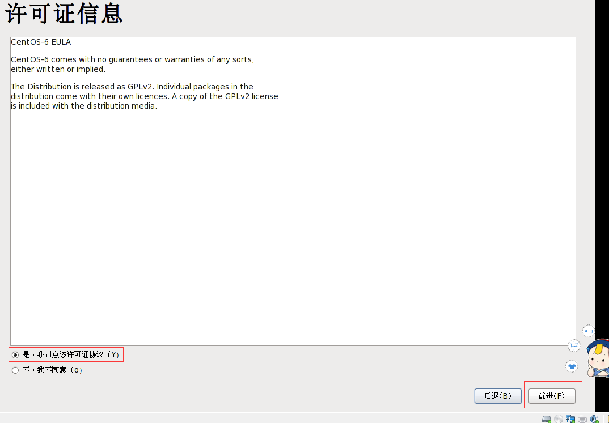
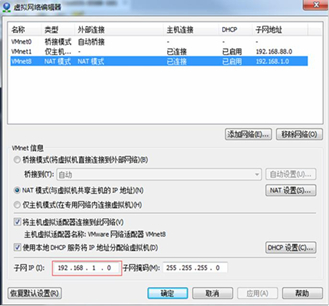

# 课程安排

## 第一部分

linux介绍

VMware和linux的安装

**快照和克隆**

**linux目录结构**

## 第二部分

远程登录,远程传输

**vi和vim编辑器的使用**

开机,重启和用户切换注销

**用户管理**

**常用指令**

**权限管理**

定时任务调度

磁盘分区和挂载

网络配置

进程管理

rpm和yum包管理工具

## 第三部分

mysql安装

shell编程

## 第四部分

ubuntu的介绍及安装

ubuntu下搭建python开发环境

apt软件管理

ubuntu远程登录


**day01:    linux介绍,VMware和linux的安装,VMtools的安装,快照及克隆,linux目录结构**

**day02:    远程登录,远程传输,vi和vim编辑器的使用,开机,重启和用户登录注销,用户管理,常用指令**

**day03:    常用指令,权限管理**

**day04:    权限管理,定时任务调度,磁盘分区和挂载,网络配置**

**day05:    进程管理,rpm和yum包管理工具,mysql安装,shell编程**


# 一. Linux介绍

## 1 Linux基本常识

### 1.1 Linux诞生的故事

**Unix篇:**

为了进一步强化大型主机的功能，让主机的资源可以提供更多的使用者来利用，所以在1964年， 由AT&A公司的贝尔实验室(Bell)、麻省理工学院(MIT)及奇异公司(GE美国通用电气公司)共同发起了Multics（多路信息计算系统）的计划， Multics计划的目的是让大型主机可以同时支持300个以上的终端机连线使用。


贝尔实验室有个叫Ken Thompson的人也参与了这个项目,并在Multics操作系统上开发了一款叫做"星际旅行"的游戏.不过,由于Multics计划的工作进度太慢,资金也短缺.所以1969年,贝尔实验室退出了Multics计划.


那年的某一天,他的妻子带着孩子要回娘家探亲一个月,Ken Thompson为了打发自己无聊的时光,同时也为了可以继续玩他的"星际旅行".于是乎,他就决定写一个操作系统来移植自己的游戏.

于此,Unix的雏形,UNICS就诞生了.只不过此时的UNICS是用汇编语言写的.移植到其它计算机上需要改很多源代码,很不方便.

于是,他又开发一门编程语言---B语言,用B语言重写了UNICS.可是,B语言写的UNICS移植起来,依旧需要改一部分源代码,他对此并不满足.

于是,又开发了一门编程语言---大名鼎鼎的C语言,并用C语言重写了UNICS.

后来,大家取其谐音,称其为Unix.


**历史过渡篇:**

起初Unix是免费开源的,所有人都可以获得其源码,各个大学也将Unix应用于操作系统的教学.

直到1970年起,AT&A公司意识到Unix的商业价值,他们开始用法律手段试图保护Unix,使得Unix的源码私有化,并且1979起不再允许大学使用其源码用于教学.

1983年的时候,有个叫斯托曼的黑客坐不住了,他认为软件应该是自由的,每个人都应该可以免费的使用,并且可以直接拿到源码,并对源码进行改进.因此他发起了GNU计划.


在1984年的时候,出现了一个叫做塔能鲍姆的大学教授,为了教学目的,基于AT&A公司的system V 开发出了一款叫做Minix的操作系统.


1985年,斯托曼创立了自由软件基金会来为GNU计划提供技术/法律/财政支持.

到了1990年的时候,GNU计划已经开发出了很多优秀的软件,那时唯一没有完成的就是操作系统的内核.


**嘣!Linux出来了!**

1991年,出现了一个叫做林纳斯的大学在校生,他基于Minux开发出了Linux的第一个版本,并在GNU的自由软件(GPL)条款下发布.在1992年的时候,成功与其它GNU软件结合.

**在Linux内核上封装了众多应用软件的操作系统就叫做Linux发行版.**


### 1.2 Linux和Unix的关系


### 1.3 Linux的读音

你们生活中一定会听到对Linux的各个读法,主流的有:**哩呐咳死**,**哩你咳死**,**哩牛咳死**

那到底哪个读音是正确的呢?

答案是:**都正确**

为什么呢,因为大家都这么读,你不管怎么读大家都能理解.

这就好比<甄嬛传>,大众都读甄huan传,虽然后来有人整幺蛾子,说嬛不读huan,读xuān.有用吗?并没有什么卵用.


### 1.4 Linux的吉祥物tux


传说,林纳斯这哥们儿写出Linux之后,想着要给Linux定一个吉祥物.但是......百思不得其解

有次他去动物园玩,看企鹅的时候,因为在想吉祥物的事情,所以分神了,再所以就被企鹅咬了.

于是,他就瞅着那只企鹅."咬我?好,就这么定了,吉祥物就是你了"

于是,Linux的吉祥物就是一只企鹅了.


### 1.5 Linux的主要发行版

我们上面说过,**在Linux内核上封装了众多应用软件的操作系统就叫做Linux发行版.**

那么,主要的发行版都有哪些呢?


这里面,有一个点要提一下.那就是centos和redhat公司的关系.

起初,redhat公司发行了**redhat**系统,发展着发展着,演变出了两个分支,一个分支是交由社区来维护和跟新,这个版本就是我们用的最多的**Centos**.而另一个分支,就是依旧由redhat公司自己负责维护和更新的版本,**redhat**,这个版本上面有些服务是需要收费的.


### 1.6 Linux和Windows的比较


## 2.为啥要学Linux

### 2.1  Linux运维工程师

​	比如说,想阿里,腾讯这样的公司,服务器有几万台甚至几十万台,这么多服务器,要保证他们的正常运行,那肯定不是python程序员干的活,得有专门的人负责这个事,那就是Linux运维工程师,

​	他们得保证服务器可以7*24小时能够不间断正常提供服务,比如说,服务器优化,日常监控,数据安全,数据备份等等.

### 2.2  linux嵌入式开发工程师

​	举个简单的例子,就比如说,你的智能手表,家里的智能家居,他们之所以智能,只因为硬件之上有操作系统,操作系统之上有软件.那么它们的操作系统,大部分就是定制裁剪后的Linux,而为他们提供软件支持的,就是Linux嵌入式开发工程师.

### 2.3  项目维护及部署

​	对于程序员,我们为什么要学Linux呢?

​	这么说吧,我们写的项目最终都是要部署到Linux下的,所以我们学Linux主要是要学习,Linux的基本操作,文件管理,环境搭建以及项目部署.

​	当然,不会也行,正常可以交给运维去做.但这对你自己本身的个人竞争力会有一个比较大的影响.


##  3.怎么学Linux

1.不需要掌握所有的Linux指令,要学会使用百度

​	那么多命令呢,记得住吗?记不住.怎么办?查就完了.

2.Linux不是编程,重点是实操


#  二.VMware和Centos的安装

## 1.Windows,VMware和Centos三者的关系


## 2.VMware安装

一路下一步,很简单


## 3. Centos安装





重点:

### 1 配置网络连接的三种形式

#### 1.1桥连接

##### 概念:

Linux可以和局域网里其它系统进行同行,会占用局域网内一个ip地址,容易造成ip冲突

##### 示意图:


#### 1.2 NAT模式

##### 概念:

网络地址转换,Linux可以访问外网,但不会造成ip冲突

##### 示意图:


#### 1.3 主机模式

##### 概念:

Linux的ip是独立的,不能访问外网


### 2.centos界面化基本使用

##### 2.1 终端使用:略

##### 2.2 配置网路(界面):(略)


## 4.VMtools安装

[在 Linux 虚拟机中手动安装或升级 VMware Tools](https://docs.vmware.com/cn/VMware-Workstation-Pro/12.0/com.vmware.ws.using.doc/GUID-08BB9465-D40A-4E16-9E15-8C016CC8166F.html)

遇到的问题:1.剪切板无法共享; 2.共享文件夹的设置;  3.窗口无法自适应

### 1 安装步骤:

管理员登陆

1.进入centos

2.点击VMware菜单--->install VMware tools

3.打开桌面上挂载好的光驱,复制VMware-tool.tar.gz到opt下

```
	cp /media/VMware\ Tools/VMwareTools-10.0.1-3160059.tar.gz  /opt/VMwareTools-10.0.1-3160059.tar.gz
```

4.切换到opt目录,tar命令解压

```
cd /opt
tar -zxvf VMwareTools-10.0.1-3160059.tar.gz
```

5.安装

```
cd vmware-tools-distrib/
./vmware-install.pl
```

6.重启生效

```
reboot
```


### 2 设置共享文件夹

说明:实际开发中正常使用xftp进行文件上传和下载,为了虚拟机上操作方便,所以设置共享文件夹

**步骤:**

1.虚拟机--->设置--->选项

2.共享文件夹---->总是启用---->添加路径

3.默认共享文件夹会放在/mnt/hgfs下


```
小练习:
1.安装VMtools
2.设置共享文件夹(路径随意),windos下编写一个hello.txt的文档
3.在Linux下打开共享文件夹,找到hello.txt,并看到里面的内容
```


## 5 创建/使用快照

### 1.什么是快照

​	说的直白一点,就是创建一个备份.

​	当执行了不可逆的错误操作后,可以通过快照用来恢复系统

### 2.创建快照的3种模式

​	挂起状态下创建快照（休眠）

​	开机状态下创建快照

​	关机状态下创建快照

### 3.如何使用快照

#### 创建:


#### 使用(恢复)


## 6.克隆

### 1.什么是克隆

​	就是以某虚拟机为母版,复制出一个一模一样的虚拟机出来,包括里面的数据

### 2.创建克隆

​	正常选择通过快照创建克隆(**只能是关机状态下的克隆**)

​	


# 三 Linux目录结构(重点)

## 1.Linux目录与Windows目录对比

### 1.1 Windows目录结构


### 1.2 Linux目录结构


**深刻理解Linux 树状文件目录是非常重要的,只有记住他们,你才能在命令行中任意切换,想去哪里去哪里**


## 2 Linux世界里---一切皆文件

对于Linux而言,所有的东西都是文件

比如说,cpu会映射到/dev下的cpu这个目录

再比如说,硬盘(disk)会被映射到/dev下的disk这个目录


## 3 Linux目录结构详解

### 3.1 /bin

存放最经常使用的指令的,比如说cp,ls,kill

### 3.2 /sbin

系统管理员使用的系统管理指令

### 3.3 /home

存放普通用户的主目录,在Linux中每个用户都有一个自己的目录,一般该目录是以用户的账号命名的

### 3.4 /root

系统管理员的用户主目录

### 3.5 /boot

存放的是启动Linux时使用的一些核心文件

### 3.6 /lib

库文件存放目录

### 3.7 /etc

存放所有系统管理所需要的配置文件,比如说mysql中的配置文件,my.conf

### 3.8 /usr

用户的很多应用程序和文件都放在这个目录下,有点像Windows下的program files目录

### 3.9 /proc,别动

这是系统内存的映射

### 3.10 /srv,别动

service的缩写,存放的是一些服务启动之后需要使用的数据

### 3.11 /sys,别动

系统相关文件

### 3.12 /tmp

用来存放临时文件

### 3.13 /dev

类似于windows的设备管理器,把所有的硬件用文件的形式存储

### 3.14 /media

Linux会识别一些设备,例如U盘,光驱等等,识别后,Linux会把识别的设备挂载到这个目录下

### 3.15 /mnt

用于让用户临时挂载别的文件系统,我们可以将外部的存储挂载在/nmt/上,然后进入该目录就可以查看里面的内容的,如我们之前设置的共享文件夹

### 3.16 /opt

正常这个文件夹是用来放安装包的

### 3.17 /usr/local

安装后的程序存放的地方

### 3.18 /var

存放经常需要被修改的文件,比如各种日志文件

### 3.19 /selinux

全名--- security enhanced linux,安全加强linux

这个类似于windows中的杀毒软件,是一种安全系统,比如收到攻击的时候这个文件会被触发


# 四 远程登录Linux系统

## 4.1 为什么要远程登录

## 4.2 Xshell5安装

略

## 4.3 连接登录

### 4.3.1 连接前提

需要Linux开启一个sshd的服务,监听22号端口,一般默认是开启的

**查看是否开启:**

```
chkconfig --list | grep sshd
```


**手动开启:**

```
chkconfig  --level 5 sshd on

service sshd restart
```


### 4.3.2 Xshell连接配置

**查看虚拟机ip:**

```
ifconfig
```


**配置Xshell:**


**测试:**

1.在/home目录下创建文件

```
cd /home
touch hello.py
```

2.重启服务器

```
reboot
```


# 五 远程上传加载文件

## 5.1 Xftp安装

略

## 5.2 Xftp连接配置


## 5.3 中文乱码问题解决


配置好后,刷新即可


```
练习题:
1.通过Xftp5连接到Linux,并传输windows下一个任意文件,到/root目录下
2.使用Xftp5连接Linux,并下载任意文件到windows
```


# 六  vi和vim编辑器


**vi** 和 **vim** 类似于windows的文本编辑器

所有的Linux系统都会内置**vi文本编辑器**

**vim**可以看做是vi增强版,具有**程序编辑能力**,支持**语法高亮**,**代码补全**,**编译**及**错误跳转**等功能,因此被广泛使用

如果Linux中没有vim这个命令,可以手动下载:

```
yum install vim
```


## 6.1 vi 和 vim 的三种常见模式

### 6.1.1 正常模式

​	正常模式下,我们可以使用快捷键对文本进行操作,比如:复制--yy  粘贴:p

​	以vim打开文档,直接进入的就是一般模式,这个模式下,我们可以使用[上下左右]来移动光标.delet删除末尾字符,等等(具体的快捷键后面会说)

### 6.1.2 插入模式

​	在插入模式下,程序员可以输入内容

​	按下i,o,a,r,I,O,A,R中任意一个键,会进入插入模式.

​	正常习惯按i,因为好记,insert

### 6.1.3 命令行模式

​	这个模式下,程序员可以输入相关指令,来完成比如:存盘,离开,显示行号等功能(具体指令后面会说)


```
例子:
使用vim编写一个hello world程序
```


## 6.2 三种模式间的切换


## 6.3 常用快捷键案例

在正常模式下执行

```
1.拷贝当前行,并粘贴
	拷贝:yy    粘贴:p
2.拷贝当前行向下5行,并粘贴
	拷贝5行:5yy
3.删除当前行
	删除:dd
4.删除当前行向下5行
	删除5行:5dd
5.光标移至最后一行
	G
6.光标移至首行
	gg
7.移动到第7行
	7gg
8.撤销
	u
```

## 6.5 常用命令

在命令行模式下执行

```
1.查找某个关键字
	/关键字
2.取消高亮
	:nohl
3.显示行号
	:set nu
4.取消行号
	:set nonu
```


```
练习:
1.编写hello world程序
2.各种快捷键试一试
```

例如：执行python.py程序

```
vim hello.py
编辑后
python hello.py
```


# 七 开机/重启/用户切换/注销

## 7.1 关机/重启命令

```
shutdown命令
	shutdown -h now :立即关机
	shutdown -h 2   :1分钟后关机
	shutdown -r now :立即重启
	shutdown -r 1	:1分钟后重启

halt
	关机
reboot
	重启
sync:
	把内存的数据同步到磁盘
```

**特别注意:**当关机或重启前,都应当先执行一下sync指令,把内存的数据写入磁盘,防止数据丢失


## 7.2 用户切换/注销

### 7.2.1 基本说明:

正常在公司是不会给你root权限的,就算给你了root权限,也不要拿root用户直接登录,避免操作失误

正常情况都是使用普通用户登录,然后主要管理员权限的时候再切换

### 7.2.2 切换用户

```
su - 用户名	切换用户
exit		  回到原来用户
```

### 7.2.3 注销用户

```
前提:图形界面无效
logout
```


# 八 用户管理

## 8.1 知识储备


1.Linux
系统是一个多用户多任务的操作系统，任何一个要使用系统资源的用户，都必须首先向系统管理员申请一个账号，然后以这个账号的身份进入系统。

2.Linux 的用户需要至少要属于一个组


## 8.2 添加用户

### 8.2.1 基本语法

```
useradd  [选项]  用户名

例子:
useradd lxx 

说明:
1.创建用户成功后会自动创建和用户名同名的家目录
```

```
指定家目录

useradd -d 目录路径 用户名


指定用户组

useradd -g 用户组名 用户名
```


## 8.3 给用户指定或修改密码

### 8.3.1 基本语法

```
passwd 用户名
```


## 8.4 删除用户

### 8.4.1 基本语法

```
userdel 用户名			删除用户,保留家目录
userdel -r 用户名		删除用户,不保留家目录
```

### 8.4.2 说明

正常在我们删除用户的时候,一般会保留家目录


## 8.5 查询用户信息

### 8.5.1 基本语法

```
id 用户名
```


**用户名不存在**


## 8.6 切换用户

### 8.6.1 说明

当用户权限不够时,可以通过`su -`,来切换到高权限用户,比如root用户

### 8.6.2 基本语法

```
su - 用户名		切换用户
exit			  返回原来用户
```

### 8.6.3 补充说明

从高权限用户切换到低权限用户时,不需要密码


```
小练习:
1.创建一个lxx的用户并指定密码
2.切换到lxx
3.尝试cd到/root目录
4.切换回root用户
5.再次cd到/root目录
```


## 8.7 用户组

### 8.7.1 说明

用以对具备同一权限的用户进行统一管理

就好比:**运维组,技术组**


### 8.7.2 增加组

```
groupadd 组名
```

### 8.7.3 删除组

```
groupdel 组名
```

**前提:组内不能有用户,否则无法删除**


## 8.8 修改用户的组

### 8.8.1 基本指令

```
usermod -g 组名 用户名
```


## 8.9 /etc/passwd 文件

这是用户的配置文件,记录着用户的各种信息


每行含义:用户名:口令(不显示):用户id:组id:注释性描述:主目录:Shell


## 8.10 /etc/shadow 文件

口令配置文件

存用户密码和相关时间的地方


## 8.11 /etc/group 文件

组的配置文件


# 九. 实用指令

## 9.1 指定运行级别

运行级别说明:

0:关机

1:单用户[找回丢失密码]

2:多用户状态[无网络服务]

**3:多用户状态[有网络服务]**

4:保留级别

**5:图形界面**

6:系统重启


## 9.2 修改默认运行级别

```
vim /etc/inittab

修改最后一行:
id:5:initdefault:
```


## 9.3 切换运行级别

### 9.3.1 基本指令

```
init [012356]
```


```
测试:
1.从图形化切到级别3
2.再切回图形化
3.切换到关机级别

```


### 9.3.2 面试题

​	如何找回 root 密码，如果我们不小心，忘记 root  密码，怎么找回。

​	思路： 进入到 单用户模式，然后修改 root 密码。因为进入单用户模式，root 不需要密码就可以登录。

```
动手:
开机->在引导时输入 回车键-> 看到一个界面输入 e ->  看到一个新的界面，选中第二行（编辑内核）在输入  e->  在这行最后输入1 ,再输入 回车键->再次输入 b ,这时就会进入到单用户模式。
这时，我们就进入到单用户模式，使用 passwd  指令来修改 root  密码。
```


```
练习:
1.假设我们的 root 密码忘记了，请问如何找回密码
2.请设置我们的 运行级别，linux 运行后，直接进入到 命令行界面，即进入到 3 运行级别
```


## 9.4 帮助指令

```
man 指令及配置文件
help shell内置指令
百度
```


## 9.5 文件目录指令

### 9.5.1 pwd指令

```
pwd		显示当前所在的目录
```


### 9.5.2 ls指令

```
ls [选项] [目录或文件]		查看文件信息
ls -a 					查看所有文件和目录,包括隐藏的
ls -l					以列表的方式显示
```


### 9.5.3 cd指令

```
cd 路径
cd ~:	回到家目录
cd ..:  回到上一级目录
```


```
练习:
1.使用绝对路径,切换到root目录
2.使用相对路径,切换到root目录,比如当前在/usr/lib
3.回到上一级目录
4.回到家目录
```


### 9.5.4 mkdir指令

```
mkdir [选项] 路径		创建文件夹
mkdir -p 路径			 创建多级文件夹
```


### 9.5.5 rmdir指令

```
rmdir [选项] 路径		删除空文件夹
rmdir -r 路径			 递归删除空文件夹

文件夹下有内容,则无法删除
```


### 9.5.6 touch 指令

```
touch 文件路径

可以一次创建多个文件
touch 文件路径1 文件路径2
```


### 9.5.7 cp指令

拷贝文件到目标路径

#### 9.5.7.1 基本语法

```
cp [选项] 源路径 目标路径

cp 源路径 目标路径  			拷贝单个文件
cp -r 源路径 目标路径			拷贝文件夹
```


```
小练习:
1./home下创建test1文件夹
2.test1文件夹中创建a.txt,b.txt,c.txt三个文件
3.把test1中的a.txt复制到/home下
4.新建一个文件夹test2
5.拷贝整个test1到test2下
```

#### 9.5.7.1 补充

当拷贝时发现相同文件,会提示[是否覆盖?]

```
\cp [选项] 源路径 目标路径		取消提示,强制复制
```


### 9.5.8 rm指令

删除目录或者文件

#### 9.5.8.1基本语法

```
rm [选项] 目标路径

rm 文件路径			删除文件
rm -r 文件夹路径		删除文件夹
rm -f xxxx			强制删除不提示
```


```
小练习:
1.删除test1中的a.txt文件
2.删除test2整个文件夹
```


### 9.5.9 mv指令

移动文件或重命名

#### 9.5.9.1 基本语法

```
mv 源路径 目标路径
```

```
小练习:
1.修改test1中的a.txt 为 d.txt
2.把test1中的c.txt 移动 到/home下
```


### 9.5.10 cat指令

显示文件内容

#### 9.5.10.1 基本语法

```
cat [选项] 文件路径

cat 文件路径		显示文件内容
cat -n 文件路径		显示文件内容,并显示行号
```


```
小练习:
1.用cat显示/etc/profile 的内容,并显示行号
```

#### 9.5.10.2 补充说明

正常情况为了方便阅读,我们会在cat指令最后加上管道符"
|",把内容传给more,分页显示

如:

```
cat -n /etc/profile | more
```


### 9.5.11 more指令

more指令是基于vi编辑器的文本过滤器,**以全屏的方式按页显示文本内容**

more指令中内置了很多快捷键,用起来很方便

#### 9.5.11.1 基本语法

```
more 文件路径
```

#### 9.5.11.2 快捷键

```
空格			向下翻一页
Enter		 向下翻一行
q			 立即离开
Ctrl+F		 向下滚动一屏
Ctrl+B		 向上滚动一屏
=			 显示当前行号
:f			 输出文件名和当前行号
```


### 9.5.12 less指令

比more更加强大,功能比more更过,这里只介绍部分

#### 9.5.12.1 基本语法

```
less 文件路径
```

#### 9.5.12.2 快捷键

```
空格				向下翻一页
pagedown		  向下翻一页
pageup			  向上翻一页
/字符串		    向下查找[字符串],n下一个,N上一个
?字符串			向上查找[字符串],n下一个,N上一个
q				  离开less
```


### 9.5.13 >指令/>>指令

#### 9.5.13.1 基本说明

把前方语句的结果存进文件,若**文件不存在会自动创建**

```
>:输出重定向			会覆盖原来文件内容
>>:追加重定向		追加到文件末尾
```

#### 9.5.13.2 示例

```
1.a.txt里写上任意内容
2.把ll 查找的结果,用输出重定向写进a.txt
3.b.txt里写上任意内容
4.把ll 查找的结果,用追加重定向写进b.txt
```


```
小练习:
1.把/etc/profile 的内容 写进 /home/c.txt中
```


### 9.5.14 echo指令

把内容输出到控制台

```
如下:
echo "我是杨家三少"
echo $PATH
```


```
小练习:
1.用echo输出'hello world'
```


### 9.5.15 head指令

head
用于显示文件的开头部分内容，默认情况下
head 指令显示文件的前
10 行内容

#### 9.5.15.1 基本语法

```
head 文件路径			查看文件前10行
head -n 5 文件路径		查看文件前5行
```


```
小练习:
1.查看/etc/profile 的前5行内容
```


### 9.5.15 tail指令

tail
用于显示文件的结尾部分内容，默认情况下tail指令显示文件的后10行内容

#### 9.5.15.1 基本语法

```
tail 文件路径			查看文件前10行
tail -n 5 文件路径		查看文件前5行
tail -f 文件路径		实时追踪文件所有的更新-----经常使用
```


```
小练习:
1.查看/etc/profile 的后5行内容
2.实时追踪/home/myinfo.txt,在虚拟机上更新myinfo.txt,看xshell的效果
```


### 9.5.16 ln指令

软链接也叫符号链接，类似于 windows 里的快捷方式，主要存放了链接其他文件的路径

```
ln -s 源文件或源文件夹 软连接名
```

```
测试:
1. 在/home目录下创建/root的软链接,名字为linktoroot
2. cd 到软链接,然后pwd,查看当前路径
3. 创建一个a.txt的文件
4. cd 到 /root目录,查看是否有变化
5. 删除/home下的linktoroot
```


### 9.5.17 history指令

查看已经执行过历史命令,也可以执行历史指令

```
history 		查看所有的历史指令
history 10		查看最近执行的10条指令
!100			执行编号为100的指令
```


**所以,在公司,指令不要瞎逼乱输**


## 9.6 时间日期类

### 9.6.1 date 指令

#### 9.6.1.1 基本语法

```
date 			显示当前日期
data +%Y		显示当前年份
data +%m		显示当前月份
data +%d		显示当前天
data +%Y-%m-%d %H:%M:%S
```


```
小练习:
1.显示当前时间信息
2.显示当前时间年月日
3.显示当前时间年月日时分秒
```


### 9.6.2 cal指令

查看日历

```
cal 		显示当前日历
cal 2020 	显示2020年的日历
```


### 9.6.3 find指令

find
指令将从指定目录向下递归地遍历其各个子目录，将满足条件的文件或者目录显示在终端

```
find [范围] [选项]
范围:指路径,不写默认从当前向下找,类似于windows的查找

选项:
-name 文件名		按文件名查找
-user 用户名		查找属于该用户的所有文件
-size 			  按文件大小查找
	+20M
	-20M
	20M
	20K
```


```
小练习:
1.根据名称查找/home 目录下的 a.txt 文件
2.查找/opt 目录下，用户名称为 lxx 的文件
3.查找整个 linux 系统下大于 20M 的文件
4.查询/ 目录下，所有.txt 的文件
```


### 9.6.4 grep 指令 和 管道符号 |

管道符:"|",表示将前一个命令的处理结果输出传递给后面的命令处理

grep:过滤查找

```
grep [选项] 过滤内容

选项:
-n		显示匹配行及行号
-i		忽略字母大小写
```


```
例子:
1.创建文件,写上多行,包含'yes'和'YES'
2.查找'yes'所在行,并显示行号
3.忽略大小写,查找'yes'所在行
```


## 9.7 压缩和解压类

### 9.7.1 gzip/gunzip 指令

用于压缩和解压文件

```
gzip 文件路径
gunzip gz文件路径
```

**说明:使用gzip压缩文件之后,不会保留原来的文件**

```
例子:
1.将 /home 下的 1.txt 文件使用gzip压缩
2.将 /home 下的 1.txt.gz 文件使用gunzip解压
```


### 9.7.2 zip/unzip 指令

zip 用于压缩文件， unzip 用于解压的，这个在项目打包发布中很有用的

```
zip [选项] xxx.zip 被压缩内容			压缩文件或者目录
	-r 								压缩目录

unzip [选项] xxx.zip  			    解压文件	
	-d 目录							指定压缩后的存放目录
```

```
例子:
1.将 /home 下的 所有文件进行压缩成 mypackage.zip
2.讲mypackge.zip解压到/opt/tmp下
```


### 9.7.3 tar指令

tar 指令 是打包指令，最后打包后的文件是
.tar.gz
的文件

```
压缩:
tar -zcvf xx.tar.gz  被压缩内容			 		   压缩
tar -zxvf xx.tar.gz	 -C 目标路径					解压

z:使用gzip格式压缩
c:创建压缩包
x:解压
f:显示压缩解压过程
```

```
例子:
1.压缩多个文件，将  /home/a1.txt 和  /home/a2.txt 压缩成	a.tar.gz
2.将/home 的文件夹 压缩成 myhome.tar.gz
3.将  a.tar.gz	解压到当前目录
4.将 myhome.tar.gz	解压到 /opt/ 目录下
```


# 十 组管理和权限管理

## 10.1 Linux组基本介绍

在 linux 中的每个用户必须属于一个组，不能独立于组外。在
linux 中每个文件有**所有者、所在组、其它组**的概念


## 10.2 文件/目录 所有者

一般为文件的创建者,谁创建了该文件，就自然的成为该文件的所有者。

### 10.2.1 查看文件的所有者

```
ls -ahl
```

```
例子:
1.创建一个组 police
2.再创建一个用户 tom
3.然后使用 tom 来创建一个文件 ok.txt，看看情况如何
```


### 10.2.2 修改文件所有者

```
chown 用户名 文件名
```

```
例子:
1.使用 root  创建一个文件 apple.txt
2.然后将其所有者修改成 tom
3.查看文件所有者
```


## 10.3 组的创建

```
groupadd 组名
```

```
例子:
1.创建一个组,monster
2.创建一个用户fox,并放到monster组中
```


## 10.4 文件/目录 所在组

当某个用户创建了一个当某个用户创建了一个文件后，默认这个文件的所在组就是该用户所在的组。

### 10.4.1 查看文件/目录 所在组

```
ls –ahl
```

### 10.4.2 修改文件所在组

```
chgrp 组名 文件名
```

```
例子:
1.使用 root 用户创建文件 orange.txt
2.查看当前这个文件属于哪个组
3.将这个文件所在组，修改到 police 组 
```


## 10.5 其他组

除文件的所有者和所在组的用户外，系统的其它用户都是文件的其它组


## 10.6 改变用户所在组

在添加用户时，可以指定将该用户添加到哪个组中，同样的用
root 的管理权限可以改变某个用户所在的组

### 10.6.1 改变用户所在组

```
usermod	–g	组名	用户名
```


## 10.7 权限基本介绍

```
ls -l
-rwxrw-r-- 1 root root 1213 Feb 2 09:39 abc

0-9 位说明
第 0 位确定文件类型(d,-,l)
第 1-3 位确定所有者（该文件的所有者）拥有该文件的权限
第 4-6 位确定所属组（同用户组的）拥有该文件的权限
第 7-9 位确定其他用户拥有该文件的权限
```


## 10.8 rwx权限详解

### 10.8.1 rwx作用到文件

```
r:可读
w:可写[可写不代表可以删除,删除一个文件的前提是对文件所在的目录有写的权限]
x:可执行
```

### 10.8.2 rwx作用到目录

```
r:可读(可用ls查看目录内容)
w:可写[可在目录内创建+删除+重命名文件或目录]
x:可执行[可以进入目录]
```


## 10.9 文件及目录权限实际案例

```
-rwxrw-r-- 1 root root 1213 Feb 2 09:39 abc

- 表示类型为文件
第一组rwx: 表示所有者 可读  可写 可执行
第二组rw-: 表示同组用户  可读 可写 但不能执行
第三组r--: 表示其他用户  只可读

可用数字表示:
r = 4
w = 2
x = 1
因此rwx = 4+2+1 = 7
```


## 10.10 修改权限

```
chmod 权限变更格式 文件或目录路径

权限变更格式一:
u:所有者	g:所有组	o:其他人	a:所有人

1. u=rwx,g=rx,o=x
2. o+w					其它用户增加w权限
3. a-x					所有人减去执行权限
```

```
例子:
1.给 abc 文件 的所有者读写执行的权限，给所在组读执行权限，给其它组读执行权限
2.给 abc 文件的所有者除去执行的权限，增加组写的权限
3.给 abc 文件的所有用户添加读的权限
```

```
权限变更格式二:
r = 4   w = 2  x = 1	rwx = 7	  rx = 5
chmod u=rwx,g=rx,o=x   可以写成		chmod 751

```

```
例子:
1.将 /home/abc 文件的权限修改成	rwxr-xr-x, 使用给数字的方式实现
```


## 10.11 修改文件所有者

```
chown newowner file			改变文件所有者
chown -R newowner 文件夹	  使得所有子文件或子目录生效
```

```
例子:
1.请将 /home/abc 文件的所有者修改成 tom
2.请将 /home/xxx 目录下所有的文件和目录的所有者都修改成 tom
```


## 10.12 修改文件所在组

```
chgrp newgroup file			改变文件所有组
chgrp -R newgroup 文件夹	  使得所有子文件或子目录生效
```

```
例子:
1.请将 /home/abc 文件的所在组修改成 bandit (土匪) 
2.请将 /home/xxx 目录下所有的文件和目录的所在组都修改成 bandit(土匪) 
```


## 10.13 小案例-警察和土匪游戏

```
police，bandit
jack, jerry: 警 察
xh, xq: 土 匪

1.创建组
2.创建用户
3.jack 创建一个文件，自己可以读写，本组人可以读，其它组没人任何权限
4.jack 修改该文件，让其它组人可以读, 本组人可以读写
5.xh 投靠 警察，看看是否可以读写
6.使用 jack  给他的家目录 /home/jack 的所在组一个 rx 的权限
7.xh重新注销再到 jack 目录,操作 jack 的文件
```


```
练习:
练习文件权限管理[课堂练习]

1.建立两个组（神仙,妖怪）
2.建立四个用户(唐僧,悟空，八戒，沙僧) 
3.设置密码
4.把悟空，八戒放入妖怪;唐僧,沙僧放入神仙
5.用悟空建立一个文件 （monkey.py 该文件要输出 i am monkey）
6.给八戒一个可以r,w的权限,唐僧,沙僧对该文件没有权限
7.八戒修改 monkey.py 加入一句话( i am pig)
8.把 沙僧 放入妖怪组
9.让沙僧修改monkey.py, 加入一句话 ("我是沙僧，我是妖怪!");

```


# 十一 crond任务调度

## 10.1示意图


## 10.2 基本语法

```
crontab [选项]

	-e : bianji crontab定时任务
	-l : 查询crontab
	-r : 删除当前用户所有的crontab任务
```


```
例子:
每分钟执行查看一次/ect目录,把目录内容写进/tml/a.txt下

具体实现步骤:
1.crontab –e
2.*/ 1 * * * * ls -l /etc >> /tmp/a.txt
3.保存退出
```


## 10.3 参数细节说明


```
时间参数案例:
1.每天22点45分执行
2.每周一的17点执行
3.每月1号的15号的凌晨5点执行
4.每周一到周五的凌晨4点40份执行
5.每天的凌晨4点,每隔10分钟执行一次命令
```


## 10.4 案例

```
1.每隔 1 分钟，就将当前的日期信息，追加到 /tmp/mydate  文件中
2.每隔 1 分钟， 将当前日期和日历都追加到 /home/mycal  文件中
```


# 十二  Linux 磁盘分区、挂载

## 12.1 分区基础知识

### 12.1.1 分区方式

```
mbr分区:
1.最多支持四个主分区
2.系统只能安装在主分区上
3.扩展分区要占一个主分区
4.mbr最大只支持2TB,但拥有最好的兼容性
```

```
gpt分区:
1.支持无限多个主分区(但操作系统会限制,比如windows下最多支持128个主分区)
2.最大支持18EB的容量(1EB=1024PB)
3.windows7 64位后支持gpt模式
```


### 12.1.2 windows下的磁盘分区


## 12.2Linux分区

### 12.2.1 原理介绍

1.Linux 来说无论有几个分区，分给哪一目录使用，它归根结底就只有一个根目录，一个独立且唯一的文件结构 , Linux 中每个分区都是用来组成整个文件系统的一部分

2.Linux 采用了一种叫“载入”的处理方法，它的整个文件系统中包含了一整套的文件和目录， 且将一个分区和一个目录联系起来。这时要载入的一个分区将使它的存储空间在一个目录下获得


### 12.2.2 硬盘说明

现在主要的硬盘都是scsi硬盘

linux中对scsi硬盘的标识为"sdx~"

如:

sda1:表示该磁盘的分区1

sda2:表示该磁盘的分区2


## 12.3 挂载的经典案例

需求是给我们的 Linux 系统增加一个新的硬盘，并且挂载到/home/newdisk

```
步骤:
1.虚拟机添加硬盘
2.分区
	fdisk /dev/sdb
	m	选择帮助
	n	增加分区
	p	划主分区
	1	主分区1
	1	默认
	w	写入分区信息并退出

3.格式化
	mkfs -t ext4 /dev/sdb1

4.挂载
	mount /dev/sdb1 /home/newdisk


5.设置自动挂载
	vim /etc/fstab
	(内容如下)
	mount -a   立即生效
```


## 12.4 磁盘情况查询

### 12.4.1 查询系统整体磁盘使用情况

```
df -lh
```


### 12.4.2 查询指定目录的磁盘占用情况

```
du 			/目录
	-h	带计量单位
	-s	指令目录占用磁盘大小
	-a	含文件
	-c  列出明细,并显示汇总值
	--max-depth=1	子目录深度
```

```
例子:
查询  /opt 目录的磁盘占用情况，深度为 1

du -ach --max-depth=1 /opt
```


### 12.4.3 常见案例

```
1.统计/home 文件夹下文件的个数
	ls -l /home | grep '^-' | wc -l
2.统计/home 文件夹下目录的个数
	ls -l /home | grep '^d' | wc -l
3.统计/home 文件夹下文件的个数，包括子文件夹里的
	ls -lR /home | grep '^-' | wc -l
4.统计文件夹下目录的个数，包括子文件夹里的
	ls -lR /home | grep '^d' | wc -l
```


# 十三 网络配置

## 13.1Linux网络配置原理图(NAT)


## 13.2 查看网络ip和网关

### 13.2.1 查看虚拟网络编辑器


### 13.2.2 修改ip地址(修改虚拟网络的ip)



### 13.2.3 查看网关


### 13.2.4 查看windows环境的中 VMnet8
网络配置 (ipconfig 指令)

1.使用命令查看

```
ipconfig
```

2.界面查看


## 13.3 ping 测试主机之间网络连通

### 13.3.1 基本语法

```
ping 目标ip				测试当前服务器是否可以连接目的主机
```

### 13.3.2 小例子

```
测试当前服务器是否可以连接百度

ping www.baidu.com
```


## 13.4 Linux网络环境配置

### 13.4.1 第一种方法(自动获取)


**此方式的缺点:**

linux 启动后会自动获取 IP,缺点是每次自动获取的
ip 地址可能不一样。这个不适用于做服务器，因为我们的服务器的
ip 需要时固定的。


### 13.4.2 第二种方法(指定固定ip)

直 接 修 改 配 置 文 件 来 指 定  IP, 并 可 以 连 接 到 外 网                                                                                                                          

```
vim  /etc/sysconfig/network-scripts/ifcfg-eth0
```


**修改配置文件后,要重启网络服务才能生效**

```
service network restart
```


# 十四 进程管理

## 14.1 基本介绍

```
1.在 LINUX 中，每个执行的程序（代码）都称为一个进程。每一个进程都分配一个 ID 号
2.每一个进程，都会对应一个父进程，而这个父进程可以复制多个子进程
3.每个进程都可能以两种方式存在的。前台与后台，所谓前台进程就是用户目前的屏幕上可以进行操作的。后台进程则是实际在操作，但由于屏幕上无法看到的进程，通常使用后台方式执行
4.一般系统的服务都是以后台进程的方式存在，而且都会常驻在系统中。直到关机才才结束
```


## 14.2 显示系统执行的进程

### 14.2.1 说明

查看进行使用的指令是     ps ,一般来说使用的参数是 `ps -aux`,`ps -ef`,正常与`grep`连用


### 14.2.2 ps指令详解

**BSD风格 详解**

```
user 			用户名称
pid				进程号
%cpu			进程占用cpu百分比
%%mem			进程占用物理内存的百分比
vsz				进程占用虚拟内存的大小
rss				进程占用物理内存的大小
tty				终端名称(后台则为?)
stat			进程状态
	S:睡眠
	s:会话的先导进程
	N:进程拥有比普通优先级更低的优先级
	R:正在运行
	D:短期等待
	Z:僵尸进程
	T:被跟踪或者被停止
start			进程启动时间
time			使用cpu总时间
command			启动进程所用的命令和参数，如果过长会被截断显示
```

**system V 风格详解**

```
uid 			用户id
pid				进程id
ppid			父进程id
C				进程占cpu百分比
stime			进程启动时间
tty				终端名称(后台则为?)
cmd				启动进程所用的命令和参数
```


```
例子:
1.查看sshd进程的父进程id是多少
```


## 14.3 终止进程kill和killall

### 14.3.1 说明

若是某个进程执行一半需要停止时，或是已消了很大的系统资源时，此时可以考虑停止该进程。


### 14.3.2 基本语法:

```
kill 进程号
	-9 强迫进程立即停止
killall 进程名称
```


### 14.3.4 例子

1.踢掉某个非法登录用户

2.终止远程登录服务
sshd, 在适当时候再次重启
sshd 服务

3.终止多个 gedit  编辑器 【killall
,  通过进程名称来终止进程】

4.强制杀掉一个终端


## 14.4 查看进程树 pstree

```
pstree [选项]
	-p    查看进程pid
	-u	  查看进程所属用户
```


## 14.5 服务(service)管理

### 14.5.1 说明

服务(service) 本质就是进程，但是是运行在后台的，通常都会监听某个端口，等待其它程序的请求，比如(mysql , sshd 防火墙等)，因此我们又称为守护进程，是
Linux 中非常重要的知识点。


### 14.5.2 基本使用

```
service 服务名 [start | stop | restart | reload | status]
```


### 14.5.3 例子

1.查看当前防火墙的状况，关闭防火墙和重启防火墙(iptables)


**service这种方式关闭或者打开服务只是临时生效**

**重启后,还是回到以前对服务的设置**


### 14.5.4 查看服务名

/etc/init.d    此文件夹下放着系统都有哪些服务

```
ls -l /etc/init.d
```


### 14.5.5 服务器运行级别(runlevel)

```
查看或者修改默认级别：	vi /etc/inittab
```

Linux 系统有 7 种运行级别(runlevel)：常用的是级别 3 和 5

运行级别 0：系统停机状态，系统默认运行级别不能设为 0，否则不能正常启动

运行级别 1：单用户工作状态，root 权限，用于系统维护，禁止远程登陆

运行级别 2：多用户状态(没有 NFS)，不支持网络

运行级别 3：完全的多用户状态(有 NFS)，登陆后进入控制台命令行模式

运行级别 4：系统未使用，保留

运行级别 5：X11 控制台，登陆后进入图形 GUI 模式

运行级别 6：系统正常关闭并重启，默认运行级别不能设为 6，否则不能正常启动


### 14.5.6 开机流程说明


### 14.5.7 chkconfig指令

#### 14.5.7.1 说明

通过 chkconfig 命令可以给每个服务的各个运行级别设置自启动/关闭


#### 14.5.7.2 基本语法

```
chkconfig							  查看每个服务的配置
chkconfig 服务名	  					查看具体服务的配置
chkconfig --level 5 服务名  on/off     给服务设置是否自动启动
```


#### 14.5.7.3 例子

```
1.请显示当前系统所有服务的各个运行级别的运行状态
2.请查看 sshd 服务的运行状态
3.将 sshd 服务在运行级别 5 下设置为不自动启动，看看有什么效果？
4.当运行级别为 5 时，关闭防火墙。
5.在所有运行级别下，关闭防火墙
6.在所有运行级别下，开启防火墙
```


**chkconfig 重新设置服务后自启动或关闭，需要重启机器
reboot
才能生效**


##  14.6 动态监控进程

### 14.6.1 说明

top
与 ps 命令很相似。它们都用来显示正在执行的进程。Top 与 ps 最大的不同之处，在于
top 在执行一段时间可以更新正在运行的的进程

### 14.6.2 基本语法

```
top [选项]
	-d			指定每隔几秒更新,默认3秒
	-i			不显示任何闲置或者僵尸进程
	-p id号		监听指定进程


交互操作:
P		以cpu使用率排序,默认就这个
M		以内存使用率排序
N		以pid排序
u		监听具体用户
k		终止指定进程
q		退出top
```


### 14.6.3 例子

```
1.监视特定用户
2.终止指定的进程
3.指定系统状态更新的时间(每隔 10 秒自动更新， 默认是 3 秒)
```


# 十五. rpm和yum

## 15.1 rpm包的管理

### 15.1.1 介绍

一种用于互联网下载包的打包及安装工具.它生成具有.RPM
扩展名的文件。RPM
是 RedHat
Package Manager（RedHat 软件包管理工具）的缩写，类似
windows 的 setup.exe


### 15.1.2 rpm包的简单查询指令

```
rpm	–qa				查询已安装的 rpm 列表
```


### 15.1.3 rpm 包名的基本格式

一个 rpm 包名：firefox-45.0.1-1.el6.centos.x86_64.rpm

```
firefox:名称
45.0.1-1:版本号
el6.centos.x86_64:centos6.X---64位
```


### 15.1.4 rpm其它指令

```
rpm -q 软件包名		 			查看是否已经安装
rpm -qi 软件包名	 			查看软件包信息
rpm -ql 软件包名	 			查看软件包中的文件安装位置
rpm -qf 文件(如:/etc/passwd)	 查看某个文件属于哪个rpm包
```


### 15.1.5 卸载rpm包

```
rpm -e 包名
```

```
例子:
rpm -e firefox
```


**包依赖问题:**

如果其它软件包依赖于你要卸载的软件包，卸载时则会产生错误信息

```
 rpm -e --nodeps 包名				强制删除
```


### 15.1.6 安装rpm包

```
rpm -ivh RPM 包全路径名称

i:install 安装
v:verbose 提示
h:hash 进度条
```

```
例子:安装firefox

1.挂载centos的iso镜像文件
2.media下找到rpm
3.拷贝到opt下
4.安装
```


## 15.2 yum

### 15.2.1 说明

Yum
是一个
[Shell ](https://baike.baidu.com/item/Shell)前端软件包管理器。基于 [RPM ](https://baike.baidu.com/item/RPM)包管理，能够从指定的服务器自动下载
RPM 包并且安装，可以自动处理依赖性关系，并且一次安装所有依赖的软件包。使用 yum 的前提是可以联网。

类型python中的pip


### 15.2.2 基本指令

```
yum list|grep xx		查询yum服务器上是否有需要安装的包
yum install xxx			下载安装
```

```
例子:
1.使用yum下载安装firefox
```


# 十六  mysql安装

以源码安装的方式编译和安装Mysql 5.6

## 1 卸载旧版本

```
rpm -qa | grep mysql		检查是否有旧版本

查询结果:mysql-libs-5.1.73-7.el6.x86_64

rpm -e mysql-libs			删除旧版本
rpm -e --nodeps mysql-libs	强行删除

```

## 2 安装mysql

### 2.1 安装源码需要编译

```
下载c的编译工具
yum -y install make gcc-c++ cmake bison-devel  ncurses-devel
```

### 2.2 上传本地mysql5.6源码包至/opt

```
xftp连接上传
```

### 2.3 编译

```
tar -zxvf mysql-5.6.14.tar.gz		解压
cd mysql-5.6.14						切换目录

编译准备:
cmake -DCMAKE_INSTALL_PREFIX=/usr/local/mysql -DMYSQL_DATADIR=/usr/local/mysql/data -DSYSCONFDIR=/etc -DWITH_MYISAM_STORAGE_ENGINE=1 -DWITH_INNOBASE_STORAGE_ENGINE=1 -DWITH_MEMORY_STORAGE_ENGINE=1 -DWITH_READLINE=1 -DMYSQL_UNIX_ADDR=/var/lib/mysql/mysql.sock -DMYSQL_TCP_PORT=3306 -DENABLED_LOCAL_INFILE=1 -DWITH_PARTITION_STORAGE_ENGINE=1 -DEXTRA_CHARSETS=all -DDEFAULT_CHARSET=utf8 -DDEFAULT_COLLATION=utf8_general_c

编译并安装:
make && make install
```

### 2.4 配置mysql

```
权限管理:

1.创建mysql组,及用户
	groupadd mysql
	useradd -g mysql mysql
	
2.修改/usr/local/mysql权限
	chown -R mysql:mysql /usr/local/mysql
	
	
初始化配置:
1.cd /usr/local/mysql
2.scripts/mysql_install_db

在启动MySQL服务时，会先在/etc目录下找my.cnf，找不到则会搜索"$basedir/my.cnf"，在本例中就是 /usr/local/mysql/my.cnf

查看/etc下是否有my.cnf,有就换个名字,防止干扰
1.mv /etc/my.cnf /etc/my.cnf.bak

添加服务(mysql服务放进/etc/init.d),并设置开机自启:
1.cp /usr/local/mysql/support-files/mysql.server /etc/init.d/mysql
2.chkconfig mysql on
3.service mysql start

配置环境变量:
1.vi /etc/profile
2.在文件中加入:
	export PATH=$PATH:/usr/local/mysql/bin
3.source /etc/profile
```


# 十七 shell编程

## 17.1 shell编程是个啥

Shell
是一个命令行解释器，它为用户提供了一个向 Linux 内核发送请求以便运行程序的系统级程序

**画图说明**


## 17.2 shell编程打印hello world

### 17.2.1 代码部分

```
#!/bin/bash
echo 'hello world'
```

代码解释:

1.#!/bin/bash:

​	告诉计算机,使用bash解释器来执行代码

2.echo:

​	控制台输出


### 17.2.2 执行代码

#### 方式一:

给脚本可执行权限

```
chmod 744 myshell.sh
```

然后直接运行脚本


#### 方式二:(不推荐)

直接调用shell解释器执行

```
sh myshell.sh
```


## 17.3 注释

### 单行注释

```
#内容
```

### 多行注释

```
:<<!
内容
!
```


## 17.4 变量

### 17.4.1 变量的介绍

```
1.Linux中变量的分类:系统变量	自定义变量
2.系统变量:
	$PATH
	$HOME
	$PWD
	$SHELL
	$USER
3.显示当前shell中所有的变量:set
```


### 17.4.2 变量的定义

#### 基本语法

```
1.定义变量:变量名=变量值
2.撤销变量:unset 变量名
3.声明静态变量:readonly 变量名.		静态变量不能unset
```

#### 快速入门

```
1.定义变量a
2.撤销变量a
3.声明静态变量b=2,尝试unset撤销
```


#### 定义规则

```
1.变量名称可以由字母、数字和下划线组成，但是不能以数字开头
2.等号两侧不能有空格
3.变量名称一般习惯为大写
```


#### 将命令的返回值赋给变量

```
1.A=`ls -la` 反引号，运行里面的命令，并把结果返回给变量 A
2.A=$(ls -la) 等价于反引号
```


## 17.5 设置环境变量

### 基本语法

```
1.export 变量名=变量值		将shell变量输出给环境变量
2.source 配置文件			 让修改后的配置信息立即生效
3.echo $变量值				  查看环境变量的值
```


### 快速入门

```
1.在/etc/profile文件中定义MY_NAME环境变量
2.查看环境变量MY_NAME的值

强调:在使用MY_NAME前,需要让其生效
3.source /etc/profile

4,在另外一个shell程序中使用MY_NAME

```


## 17.6 位置参数变量

### 介绍

当我们执行一个 shell
脚本时，如果希望获取到命令行的参数信息，就可以使用到位置参数变量


### 基本语法

```
1.
$n （功能描述：n 为数字，$0 代表命令本身，$1-$9 代表第一到第九个参数，十以上的参数，十以上的参数需要用大括号包含，如${10}）

2.
$* （功能描述：这个变量代表命令行中所有的参数，$*把所有的参数看成一个整体）

3.
$@  （功能描述：这个变量也代表命令行中所有的参数，不过$@把每个参数区分对待）

4.
$#（功能描述：这个变量代表命令行中所有参数的个数）

```


### 快速入门

```
编写一个shell脚本,pasition.sh,在脚本中获取到命令行的各个参数信息
```


## 17.7 预定义变量

### 介绍

就是 shell 设计者事先已经定义好的变量，可以直接在
shell 脚本中使用


### 基本语法

```
$$ 	（功能描述：当前进程的进程号（PID））
$!	（功能描述：后台运行的最后一个进程的进程号（PID））
$?	（功能描述：最后一次执行的命令的返回状态。如果这个变量的值为 0，证明上一个命令正确执行；如果这个变量的值为非 0（具体是哪个数，由命令自己来决定），则证明上一个命令执行失败)
```


### 快速入门

```
在一个shell脚本pre.sh中简单实用一下预定义变量(提示, ./myshell.sh &  后台运行myshell.sh)
```


##17.8  运算符

### 基本语法

```
1.$((运算式))
2.$[运算式]
3.`expr m + n`
	特点:运算符之间要有空格
	+
	-
	/
	%
	\*
	\(	\)
	
```


### 快速入门

```
写一个demo.sh完成:
1.3种方式计算(2+3)*4的值
2.方式2求出命令行两个参数的和
```


## 17.9 判断

### 基本语法

```
[ 条件 ]			注意:条件前后要有空格

特别的:
[ 非空 ]	  为true
[]		   为false
[ haha ] && echo true || echo false
```


### 判断语句

#### 字符串比较

```
=	判等
!=  判不相等
```

#### 整数比较

```
-lt		小于
-le		小于等于
-gt		大于
-ge		大于等于
-eg		等于
-ne		不等于
```

#### 文件权限判断

```
-r	有读的权限	[ -r 文件 ]
-w	有写的权限
-x	有执行权限
```

#### 文件类型判断

```
-f 存在并且是一般文件	[-f 文件]
-e 文件存在
-d 存在并且是一个目录
```


### 快速入门

```
1.'ok'是否等于'ok'
2.'ok100' 是否等于 'ok'
```


```
3.23 是否大于 23
4.23 是否大于等于 23
```


```
5./root是否存在
6./root是否是一般文件
```


## 17.10 流程控制

### 17.10.1 if判断

#### 基本语法

```
if [ 条件 ]
then
	代码
fi
```

```
if [ 条件 ]
then
	代码
else
	代码
fi
```

```
if [ 条件 ]
then
	代码
elif [ 条件 ]
then
	代码
else
	代码
fi
```


#### 快速入门

```
编写shell脚本,if.sh:
如果输入参数,大于等于60,则输出'及格了',如果小于60,则输出'不及格'
```


### 17.10.2 case 选择分支

#### 基本语法(相当诡异,令人发指,what a fuck)

```
case $变量名 in
'值1')
代码
;;
'值2')
代码
;;
*)
代码					都没命中执行
;;
esac
```


#### 快速入门

```
编写shell脚本,case.sh:
当命令行参数是1时,输出'周一';是2时,输出'周二',是3时,输出'周三',其它情况,输出'其它'
```


### 17.10.3 for循环

#### 遍历

##### 基本语法

```
for 变量 in 值1 值2 值3
do
	代码
done
```

##### 快速入门

```
编写foreach.sh:
打印命令行输入的参数[这里可以看出$*和$@的区别]
```


#### 循环

##### 基本语法

```
for {{初始值;循环条件;变量变化}}
do
	代码
done
```

##### 快速入门

```
编写for.sh:
从1加到100,并输出结果
```


### 17.10.4 while循环

#### 基本语法

```
while [ 条件 ]
do
	代码
done
```


#### 快速入门

```
编写while.sh:
从命令行中输出一个数n,统计1+...+n的值是多少
```


## 17.11 与用户交互

### 基本语法

```
read 选项 变量
选项:
-p:提示信息
-t:等待输入的时间
```

### 快速入门

```
编写input.sh:
1.读取控制带输入的值
2.读取控制台输入的值,等待6秒
```


## 17.12 函数

### 17.12.1 系统函数

#### basename

##### 基本语法

```
basename [pathname] [suffix]
获得路径最后一部分

如果指定的suffix,那么会去掉结果中suffix的部分
```

##### 快速入门

```
1.返回/home/aaa/test.txt中'test.txt'的部分
2.返回/home/aaa/test.txt中'test'的部分
```


#### dirname

##### 基本语法

```
dirname [pathname]
获得基础路径
```

##### 快速入门

```
1.返回/home/aaa/test.txt中'/home/aaa'的部分
```


### 17.12.2 自定义函数

#### 基本语法

```
function 函数名(){
	代码;
	#参数使用:$1,$2,...,${10}...
	return xxx;
}

调用:
函数名 值1 值2
```


#### 快速入门

```
编写func.sh:
用函数的形式,计算两个参数的和
```


## 17.13 shell综合案例

```
在/root下编写mysql_db_backuo.sh

需求:
1.每天凌晨2点10分,备份数据库mydb  到/data/backup/db
2.备份开始和备份结束时能够给出提示信息
3.备份后的文件要求以备份时间为文件名,并打包成.tar.gz的形式,如2019-09-28-044403.tar.gz
4.在备份的同时,检查是否有10天前的备份文件,如果有就删除
```

```
#!/bin/bash

#备份的路径
BACKUP=/data/backup/db
#当前的时间作为文件名
DATETIME=$(date +%Y_%m_%d_%H%M%S)

echo "=======开始备份======"
echo "=====备份的路径是 $BACKUP/$DATETIME.tar.gz"

#主机
HOST=localhost
#用户名
DB_USER=root
#密码
DB_PWD=997997
#备份的数据库
DATABASE=mydb


如果备份路径不存在,就创建
[ ! -d "$BACKUP/DATETIME" ] && mkdir -p "$BACKUP/$DATETIME"
#执行mysql的备份指令
mysqldump -u$DB_USER -p$DB_PWD --host=$HOST $DATABASE | gzip > $BACKUO/$DATETIME/$DATETIME.sql.gz
#打包备份文件
cd $BACKUP
tar -zcvf $DATETIME.tar.gz $DATETIME
#删除临时目录
rm -rf $BACKUP/$DATETIME


#删除10天前的文件
find $BACKUP -mtime +10 --name "*.tar.gz" -exec rm -rf {} \;

echo "=====备份成功+++++"
```


# 十八 程序员装逼之----Ubuntu

## 18.1 Ubuntu介绍

1.Ubuntu是一个以桌面应用为主的开源操作系统,它的界面做的非常好看

2.专业的程序员一般会选择Ubuntu

```
原因:
1.为了装逼
2.开发环境更加接近真实服务器环境,因为都是基于GNU/Linux内核开发的
3.穷
```

3.下载地址:[http://cn.ubuntu.com/download](http://cn.ubuntu.com/download/)


## 18.2 安装

略,比centos更加简单


## 18.3 设置Ubuntu支持中文

默认安装的
ubuntu 中只有英文语言，因此是不能显示汉字的。要正确显示汉字，需要安装中文语言包。

### 步骤:

```
1.单击左侧图标栏打开 System Settings（系统设置）菜单，点击打开 Language Support（语言支持）选项卡。
2.点击 Install / Remove Languages，在弹出的选项卡中下拉找到 Chinese(Simplified)，即中文简体， 在后面的选项框中打勾。然后点击 Apply Changes 提交，系统会自动联网下载中文语言包。（保证
ubuntu 是联网的）。
3.这时“汉语（中国）”在最后一位因为当前第一位是”English”，所以默认显示都是英文。我们如果希望默认显示用中文，则应该将“汉语（中国）”设置为第一位。设置方法是拖动，鼠标单击
“汉语（中国）”，当底色变化（表示选中了）后，按住鼠标左键不松手，向上拖动放置到第一位。
4.设置后不会即刻生效，需要下一次登录时才会生效。
```


## 18.4  root用户

ubuntu安装后,默认是普通用户,这时候要获得权限就得:

1.sudo

2.su root

 

### 设置root用户的密码并使

```
1.sudo passwd
```


## 18.5 Ubuntu使用python

ubuntu安装成功后,默认会带上python2 和 python3,无需另外安装

ubuntu下可以安装各种python的ide环境,包括pycharm

https://baijiahao.baidu.com/s?id=1622347860160507809&wfr=spider&for=pc


## 18.6 apt软件管理工具

apt 是 Advanced Packaging Tool 的简称，是一款安装包管理工具。在 Ubuntu 下，我们可以使用 apt

命令可用于软件包的安装、删除、清理等，


### apt软件相关命令

```
sudo apt-get update	更新源
sudo apt-get install package 安装包
sudo apt-get remove package 删除包
sudo apt-cache show package	获取包的相关信息，如说明、大小、版本等
sudo apt-get source package	下载该包的源代码


----------------------以上命令最为常用---------------------------


sudo apt-cache search package 搜索软件包
sudo apt-get install package --reinstall	重新安装包
sudo apt-get -f install	修复安装
sudo apt-get remove package --purge 删除包，包括配置文件等
sudo apt-get build-dep package 安装相关的编译环境
sudo apt-get upgrade 更新已安装的包
sudo apt-get dist-upgrade 升级系统
sudo apt-cache depends package 了解使用该包依赖那些包sudo apt-cache rdepends package 查看该包被哪些包依赖

```


### 更换镜像源

清华开源软件镜像站:https://mirrors.tuna.tsinghua.edu.cn/

ubuntu的软件源配置文件是/ect/apt/source.list


#### 1.备份/ect/apt/source.list

```
mv /ect/apt/source.list /ect/apt/source.list.backup
```

**若权限不够,切换root用户,或使用sudo**


#### 2.替换/ect/apt/source.list内容

```
1.vim /ect/apt/source.list
2.写入清华镜像源文件内容
```


#### 小案例

```
1.apt-get remove vim
2.apt-get install vim
3.apt-cache show vim
```


## 18.7 ssh远程登录

和 CentOS 不一样，Ubuntu 默认没有安装
SSHD 服务,因此需要安装


###18.7.1  安装

```
apt-get install openssh-server
service sshd restart

查看监听状态:
netstat -nap | more
```

此时xshell就可以连接了


### 18.7.2 其它

```
openssh-sever会安装客户端和服务端,
所以ubuntu在此时也可以连接其它有sshd服务的机器


基本语法：
ssh 用户名@IP
例如：ssh mac@192.168.188.131
使用 ssh 访问，如访问出现错误。可查看是否有该文件 ～/.ssh/known_ssh  尝试删除该文件解决。
登出命令：exit 或者 logout
```

