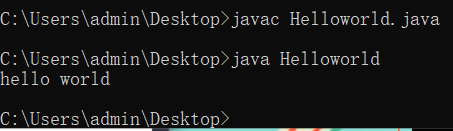

# 本周内容

## 1 elasticsearch 全文检索引擎

-写代码实现通过es，实习查询

-haystack对接es，兼容性比较差（比较老）

-原理，倒排索引

-增删查改：基本查询，组合查询

-分词：默认，ik分词

-python对接es

-es的集群（天生支持）

## 2 面试相关之五险一金

## 3 如何提高网站的并发量

## 4 分布式id的生成方案

## 5 分布式锁--redis

## 6 简历编写

## 7 面试如何聊


# 今日内容

## 1 面试相关之五险一金

```python
#1 五险（养老，医疗，生育，失业，工伤）+一金（住房公积金）
#2 正规单位工作(劳动合同)，公司都会交（国家强制）
#3 总的算下来，交的钱比较多，中小型公司承受不住压力（二三四线城市，一线城市比较少），不给你交，比较大的公司，试用期，不给交（越来越严格）
#4 交的钱多，大部分公司（95%以上，不足额交）
#5 工资组成（基本工资（4500）+绩效+奖金），税前工资（很少很少公司跟你保证税后工资，小公司，不给交社保，不给交税）
#6 专业问法：公积金基数是多少，社保基数是多少？
#7 工资是14k，同学问，这是税前还是税后？
#8 算好你上家公司的工资，11k（基本工资+绩效），不需要说
#9 如何算你的税，如何算你的公积金，如何算社保（足额交还是按基数交）
#10 足额：按你工资交14000工资足额交，至少一千四一个月的社保   基数：按一定基数交（每个城市：最低工资），五险基数不能低于最低工资
#11 五险---每个月需要交你工资的11%，按基数给你交（对你和对公司都有好处），每个月扣的钱少，拿到手的钱多，公司也是，交的钱少（公司需要交你工资31%），
#12 足额：你的工资是10k，税后（税和五险一金）工资：7k多，不到8k，公司在你身上投入的13k多
#13 交的少对你有好处：
	-咱们国家社保两条线：一条公务员（事业编，公务员，老师），一条企业员工
  -基本上都是国家交（包括个人部分，比企业少），公务员退休后，基本上工资不变，没有拿的养老保险，基本上可以覆盖你之前的工资80%
  -企业，交的多，退休之后，能拿到基本上一千左右（现在也就交400）：你 缴费总额（15年养老保险），社会平均工资，60岁退休，算你能活到75岁（15年），计算方式---算出你每个月拿多少钱30岁，60岁退休，通胀，现在五险一直在改革，因为现在养老保险出现亏空，随着退休的人越来越多，年轻人越来越少，交的越来越少，支出越来越多，你只需要交着就行（享受待遇即可）
  -一定要交：不同城市要求社保不一样（上海：要求5年连续社保（中间不能断，换工作要无缝衔接，一旦断了，从头算），才能买房，还有一些城市，一年，两年）
  -正常享受待遇，国家要求养老保险交够15年（不一定连续），医疗保险交够25年（医疗报销待遇）
  -社保是省统筹：如果不是一个城市，社保需要转移
#14  有一些比较穷的公司，交三险（现在几乎没有了，都是五险）
#15 养老，医疗，生育，失业，工伤分别有什么用（都不能选择不交，强制的）
	-养老，交够15年，退休，公司不给你发钱了，国家按月给你发钱（退休金，企业员工退休金比较少一些）
  -医疗：交够25年，一直交着，工作过程中就一直享受，去医院动手术，国家报销一部分，退休以后，（国家给你交），可以一直享受待遇
  -失业保险：一旦失业，国家给你发几个月工资（全是公司交，一个月几十块钱）
  -生育：你交，男女都要交，生孩子，国家会给你一笔钱，你媳妇休产假，国家给你媳妇发工资（公司不发，计算方法，企业平均工资）
  -工伤：你在工作过程中和上下班途中出事了，国家会给钱（如果死亡，会有死亡抚恤金），要求比较苛刻
 #16 其实养老和医疗有个人账户和国家统筹
	-养老保险，你交的，进你个人账户（一个月交了400，你是能看到数字的），钱就是你的（只是提不出来），等你退休才能用
  公司交的这部分，不是给你的，跟你一点关系没有（是公司在你身上花的钱），国家统筹，发给现在已经退休的老人们
  -医疗保险：个人账户和国家统筹，你交的钱，放在你的医保卡里了，医保卡可以去药店买药，刷医保卡，你之前交的钱
 # 总结：五险必须交，但是尽量少交
 # 公司会按一定基数给你交
 
#一金：住房公积金（跟5险不是一家）
# 最高可以叫工资的12%   1w工资，你最高可以交 -1200，你交多少，公司给你交多少，公司交的1200就是你的钱
# 一般公司交8%，10%，这是另一条线（一般会跟社保一样）
# 有啥用：可以用公积金贷款，正常商业贷款利率：4.9   公积金利率：3.2.。。。（粗略）
-200w，代个30年，4.9 ，利息要200多万，还款400多万，所以可以使用公积金贷款，利率低，利息低
-公积金贷款，能带出来的钱，是有限制的，根据你交的多少，代多少（不同城市，规定不一样），交的越多，代的越多
-假设你公积金账户就10w块，你是贷不到200w，于是有了混合贷
-好多开发商，不让你用公积金贷款，因为下款很慢
-还款的钱，可以从公积金账户中扣除----公务员买房子，公积金基本上可以覆盖掉贷款（公务员交的多）
-如果不买房，钱可以用来租房子（从账户提钱，租房子），装修房子。。。
-如果不在这个城市了，可以一次性提出来

#这公积金：能多交就多交（但是公司不傻，有的公司，就给你交固定的一部分，你想多交，从你工资里拿着交）

总结：
-入职时：公司怎么给你交，你就怎么弄就行了，不要在这上面较真了
-面试时，入职时：这家公司会问你几个问题
	-你上家公司交没交社保？交在哪？（不通城市，不通用）公司查不到
  	-主要是他要给你交社保：一个是续交（之前在上海交过），一个是办增员（之前没在上海交过）
    -之前有没有在上海交过，有交过，就正常说，几几年交过
    -没有交过，如果在上海工作，就说没交，或者是在其他城市工作
    -不通城市，什么都看不到，系统都不通用（数据库根本不连通）
    -能看到你上海的公司之前交过的（hr能看到，她不会去管你这个事）
    -到目前为止，没有省级统筹（市里自己一套），你的那个社保卡，只能再当前城市使用，去药店买药，换了城市，不能用
  

 非得说为什么没交：上家公司试用期不交，转正之后要交，需要自己提交好多材料，我嫌麻烦，就一直没交，（说不说都可以：本来想交的，后来辞职了）


```


## 2 介绍elasticsearch

```python
# es:当成数据库（mysql，mongodb），存数据的软件，主要用来搜索，全文检索
# 目前 github搜索，全部用es了
# 用java写的，运行java程序，安装：jdk
jkd，jre，jvm
```


## 3 安装和简单使用

```python
1 安装jdk
	-下载1.8及以上
	-java是sun公司出的，后来被甲骨文收购了，java一开始免费，现在开始收费（javase，javaee收费）
  -版本：1.5版本，java 8 大更新（es必须在1.8以上），java 9  java 10   java 11
  -jdk就包含了jre
  -java -version    表示安装完成,环境变量已经配好了
  		----可以不配置：正常情况下，需要配置java_home
  -就可以开发java项目
  -需要一个ide，eclipse,myeclipse   推荐你用idea
  -了解
  	-写一个java文件
    -javac 文件名.java  编译
    -java 文件名 执行
2 安装es
	-https://elasticsearch.cn/download/
	-2.几：公司好多在用，haystack就是基于这个版本的
  -6.几：大更新（两个都支持）
  -7.几：完全的更新（完全不支持）
  -下载完，解压即可
  -cd到目录下启动es
  -执行可执行文件：./elasticsearch
  -对比mysql：监听3306端口，mysql客户端（Navicat...）
  -es：监听9200端口，es是基于resful的，直接在浏览器访问（浏览器就是客户端）
```



