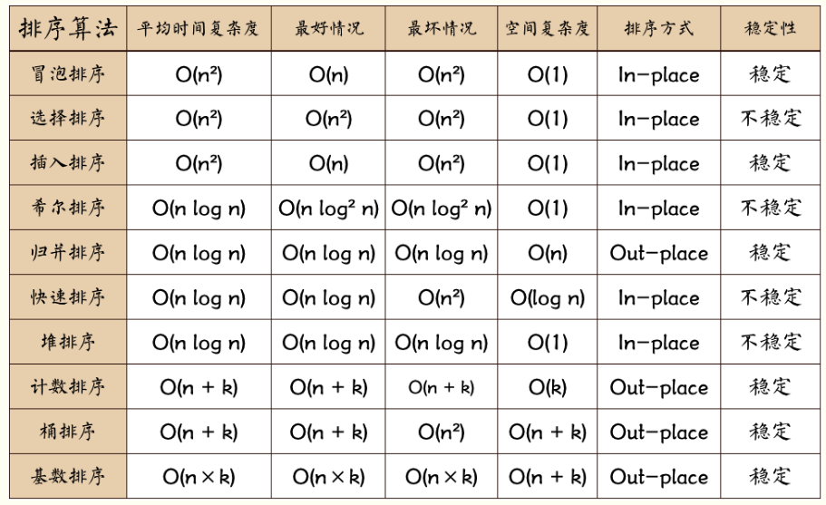

数据结构和算法的地位 

计算机组成原理 

网络原理和应用 

数据结构和算法 

操作系统 

。。。。 

数据结构和算法学完之后，啥都干不了，并不像 html+css+js ,能做出一些可见的东 

西。但是数据结构和算法，它能够锻炼我们的编程思维。校招的时候，面试题：数据结构和 

算法、网络、linux。比特币 

数据结构和算法面试的时候，都会问到。比如字节跳动，华为，百度，上来就是一道算法题 

手撕红黑树 

# 1.算法

衡量算法快慢的标准 

## 时间复杂度 

思考：让你比较一下两个程序运行的快慢？怎么做？ 

答：用time去实现 time.time() 

思考：使用time模块来进行比较的前提？ 

答：两个程序是在同一个硬件配置相同的条件下才能比较 

因此，需要考虑更换另一种衡量方式，即程序大概运行次数 

时间复杂度就是用来计算程序大概运行的次数的 ，使用O记

```python
n = 64
while n > 1:
    print(n)
    n = n // 2
# 结果 因为循环减半   O(log2 n) or O(log n)--->2^6 = 64  以2 为底 n 的对数 lg n 以10 为底 n 的对数
64
32
16
8
4
2
```

时间复杂度是用来估计算法运行时间的一个式子（单位）

一般来说，时间复杂度高的算法比时间复杂度低的算法慢

常见的时间复杂度（安卓效率来排序）

O(1)<O(log n)<O(n)<O(nlogn)<O(n^2)<O( n^2logn)<O( n ^3)

不常见的时间复杂度

O(n!)O(2^n)O( n^n)

数据库的index的底层原理b+树，速度快，时间复杂度是O(logn)

如何一眼判断时间复杂度？

* 循环减半的过程--> O(log n)
* 几次循环就是n的几次方的复杂度


## 空间复杂度 

S(n)表示空间复杂度

衡量程序算法占用内存空间大小的 

首先，大家想一下，给一筐苹果，让你从小到大排序？ 

## 查找

### 列表查找：从列表中查找指定元素

输入：列表、待查找元素
输出：元素下标或未查找到元素

```python
def linear_search(data_set, value):
    for i in range(range(data_set)):
        if data_set[i] == value:
            return i
    return

#时间复杂度O(n)
```

```python
def bin_search(data_set, value):
    low = 0
    high = len(data_set) - 1
    while low <= high:
        mid = (low+high)//2
        if data_set[mid] == value:
            return mid
        elif data_set[mid] > value:
            high = mid - 1
        else:
            low = mid + 1
#时间复杂度O(log n)
```


### 顺序查找

从列表第一个元素开始，顺序进行搜索，直到找到为止。


### 二分查找

从有序列表的候选区data[0:n]开始，通过对待查找的值与候选区中间值的比较，可以使候选区减少一半。

```python
def bin_search_rec(data_set, value, low, high):
    if low <= high:
        mid = (low + high) // 2
        if data_set[mid] == value:
            return mid
        elif data_set[mid] > value:
            return bin_search_rec(data_set, value, low, mid - 1)
         else:
            return bin_search_rec(data_set, value, mid + 1, high)
     else:
         return
```


## 排序

列表排序
将无序列表变为有序列表
应用场景：
各种榜单
各种表格
给二分排序用
给其他算法用

输入：无序列表
输出：有序列表


排序方法：升序与降序

排序low B三人组：
冒泡排序
选择排序
插入排序
快速排序
排序NB二人组：
堆排序
归并排序
没什么人用的排序：
基数排序
希尔排序
桶排序

### 冒泡排序 （*******） 

列表每两个相邻的数，如果前边的比后边的大，那么交换这两个数…… 

```python
def bubble_sort(lis):
    for i in range(len(lis)):
        for j in range(len(lis)-i-1):
            if lis[j]>lis[j+1]:
                lis[j],lis[j+1]=lis[j+1],lis[j]
    print(lis)
bubble_sort(lis)
#时间复杂度O（n^2）
```

冒泡排序优化

如果冒泡排序中执行一趟而没有交换，则列表已经是有序状态，可以直接结束算法。

```python
def bubble_sort_1(li):
    for i in range(len(li)-1):
        exchange = False
        for j in range(len(li)-i -1):
            if li[j]>li[j+1]:
                li[j],li[j+1]=li[j+1],li[j]
                exchange = True
        if not exchange:
            return 
```


### 选择排序 

一趟遍历记录最小的数，放到第一个位置；
再一趟遍历记录剩余列表中最小的数，继续放置；

问题是：怎么选出最小的数？

代码关键点：
无序区
最小数的位置

```python
def select_sort(li):
    for i in range(len(li)):
        minloc = i
        for j in range(i+1,len(li)):
            if li[minloc]>li[j]:
                li[minloc],li[j]=li[j],li[minloc]

select_sort(lis)
#时间复杂度O（n^2）
```

```python
def select_sort(li):
    for i in range(len(li) - 1):
        min_loc = i
        for j in range(i+1, len(li)):
            if li[j] < li[min_loc]:
                min_loc = j
        if min_loc != i:
            li[i], li[min_loc] = li[min_loc], li[i]
#时间复杂度O（n^2）
```


### 插入排序

斗地主，整理牌的方法 

代码关键点：
摸到的牌
手里的牌


列表被分为有序区和无序区两个部分。最初有序区只有一个元素。
每次从无序区选择一个元素，插入到有序区的位置，直到无序区变空。

```python
def insert_sort(li):
    for i in range(1,len(li)):#设置0 为有序的
        tmp = li[i]
        j = i-1
        while j>=0 and tmp<li[j]:
            li[j+1] = li[j]
            j = j-1
        li[j+1] = tmp
    print(li)
insert_sort(lis)
#时间复杂度O（n^2）
时间复杂度：O(n2)
优化空间：应用二分查找来寻找插入点（并没有什么卵用）
```

### 快速排序 （***\***）

取一个元素p（第一个元素），使元素p归位；
列表被p分成两部分，左边都比p小，右边都比p大；
递归完成排序。


O(nlogn)

```python
# 快速排序
def partition(li, left, right):
    tmp = li[left]
    while left < right:
        while left < right and li[right] >= tmp:
            right = right - 1
        li[left] = li[right]
        while left < right and li[left] <= tmp:
            left = left + 1
        li[right] = li[left]
    li[left] = tmp
    return left
O(n)

def quick_sort(li,left,right):
    if left < right:
        mid = partition(li,left,right)
        quick_sort(li,left,mid-1)
        quick_sort(li,mid+1,right)
quick_sort(lis,0,len(lis)-1)
print(lis)
O(logn)
```


### 快速希尔排序 

希尔排序是一种分组插入排序算法。
首先取一个整数d1=n/2，将元素分为d1个组，每组相邻量元素之间距离为d1，在各组内进行直接插入排序；
取第二个整数d2=d1/2，重复上述分组排序过程，直到di=1，即所有元素在同一组内进行直接插入排序。
希尔排序每趟并不使某些元素有序，而是使整体数据越来越接近有序；最后一趟排序使得所有数据有序。

时间复杂度：	O((1+τ)n)
	     	O(1.3n)

```python
def shell_sort(li):
    gap = len(li) // 2
    while gap > 0:
        for i in range(gap, len(li)):
            tmp = li[i]
            j = i - gap
            while j >= 0 and tmp < li[j]:
                li[j + gap] = li[j]
                j -= gap
            li[j + gap] = tmp
        gap /= 2
# shell_sort(li)
def insert_shell(nums):
    # 初始化l值，此处利用序列长度的一半为其赋值
    l = int(len(nums)/2)
    # 第一层循环：依次改变l值对列表进行分组
    while l >= 1:
    # 下面：利用直接插入排序的思想对分组数据进行排序
        for i in range(len(nums) - 1):

            for j in range(i, -1, -1):

                if nums[j] > nums[j + 1]:
                    nums[j], nums[j + 1] = nums[j + 1], nums[j]
    # while循环条件折半
        l = int(l/2)
    return nums


print(insert_shell(li))
```


### 计数排序

现在有一个列表，列表中的数范围都在0到100之间，列表长度大约为100万。设计算法在O(n)时间复杂度内将列表进行排序。

#### 计数排序


[0-100]

 

重点：

时间复杂度和空间复杂度 

```python
def count_sort(list:li):
    count = [0 for _ in range(6)]
    print(count)
    for i in li:
        count[i]+=1
    print(count)
    li.clear()
    print(li)
    for n,num in enumerate(count):
        print(n,num)
        for k in range(num):
            print(k)
            li.append(n)
            print(li)

count_sort(li)
print(li)

```

| 排序方法     |          | 稳定性   | 代码复杂度 |        |        |
| ------------ | -------- | -------- | ---------- | ------ | ------ |
| 最坏情况     | 平均情况 | 最好情况 |            |        |        |
| 冒泡排序     | O(n2)    | O(n2)    | O(n)       | 稳定   | 简单   |
| 直接选择排序 | O(n2)    | O(n2)    | O(n2)      | 不稳定 | 简单   |
| 直接插入排序 | O(n2)    | O(n2)    | O(n2)      | 稳定   | 简单   |
| 快速排序     | O(n2)    | O(nlogn) | O(nlogn)   | 不稳定 | 较复杂 |
| 堆排序       | O(nlogn) | O(nlogn) | O(nlogn)   | 不稳定 | 复杂   |
| 归并排序     | O(nlogn) | O(nlogn) | O(nlogn)   | 稳定   | 较复杂 |
| 希尔排序     |          | O(1.3n)  |            | 不稳定 | 较复杂 |



# 2.数据结构 

## 线性结构

可以使用一根线穿起来的数据结构 

数组 （列表） 

li = [1,2,3,4,5,6,7,8] 对内存的要求是：需要操作系统给我们分配一块连 

续的内存空间 

比如说：int a[7] 表示的意思是：a这个数组只能保存7个元素， 并且这7个元 

素必须是整数 

int a[7] = [1,2,3,4,5,6,7] 分配内存的原理：c语言使用malloc(4*7) 

向操作系统申请28个字节的内存空间。数组使用完成之后，c语言使用 free() 

释放. 如果只是一味的申请，而不是释放，就会造成内存溢出 

数组的查找：a[3] = 数组的起始地址 + 3*4 (偏移量) 数组的起始地址保存  

在数组名中 

假设内存中，没有一块连续的内存空间，但是我还想保存数据，那怎么办？ 

### 链表

### 线性结构的应用 

### 队列

### 栈 

### 函数 

## 非线性结构 

### 树 

### 一般树 

### 二叉树

### 完全二叉树 

### 满二叉树 

### 森林图 

问：mysql索引的目的是啥？ 

答：提高查询速度 

问：既然是提高查询速度，是不是就要求时间复杂度越高效越好？ 

答：最高效的时间复杂度是O(1), 

O(1)<O(logn)<O(n)<O(nlogn)<O(n2)<O(n2logn)<O(n3) 

问：哪中方式结构是 O(1)的时间复杂度 

答：哈希(hash) 是散列在内存中的 每次查找值的时候， 查找到地址， 一下子就查找这个值 

问：那既然hash的时间复杂度这么的高效， 为啥不使用hash作为我们的索引数据结构？ 

答：如果使用hash作为索引的数据结构的话，对类似这样的SQL语句查询有效： 

select * from xxx where name=123 

但是对于mysql而言，有范围的sql查询语句， 就不是高效了， 例子： 

select * from xxx where age between 12 and 89 

因此，针对上述的问题，就不使用hash作为数据结构。因此使用树作为数据结构。时间复杂度 

O（logn） 

首先，树中，当时选择是二叉树做为mysql索引底层结构。但是二叉树的缺点是：二叉树要求每个 

节点最多两个节点。数据量大的时候，查询速度就会降低。因为树的深度会非常的深 

所以，基于以上原因，使用B树