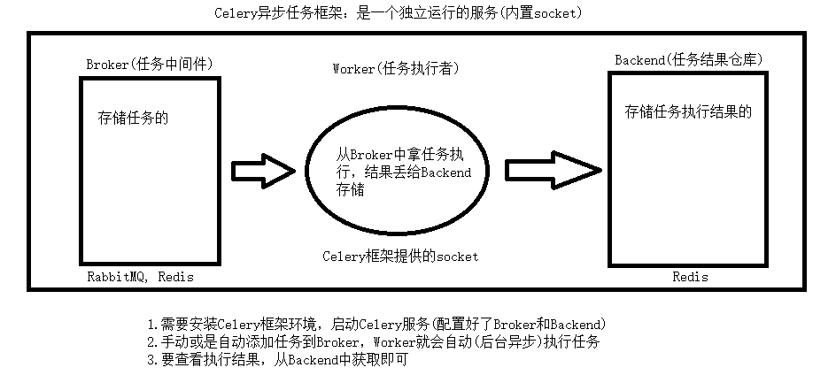

# Celery

### 官方

Celery 官网：http://www.celeryproject.org/

Celery 官方文档英文版：http://docs.celeryproject.org/en/latest/index.html

Celery 官方文档中文版：http://docs.jinkan.org/docs/celery/


## Celery架构

Celery的架构由三部分组成，消息中间件（message broker）、任务执行单元（worker）和 任务执行结果存储（task result store）组成。



#### 消息中间件

Celery本身不提供消息服务，但是可以方便的和第三方提供的消息中间件集成。包括，RabbitMQ, Redis等等

#### 任务执行单元

Worker是Celery提供的任务执行的单元，worker并发的运行在分布式的系统节点中。

#### 任务结果存储

Task result store用来存储Worker执行的任务的结果，Celery支持以不同方式存储任务的结果，包括AMQP, redis等


## 使用场景

异步任务：将耗时操作任务提交给Celery去异步执行，比如发送短信/邮件、消息推送、音视频处理等等

定时任务：定时执行某件事情，比如每天数据统计


## Celery的安装配置

pip install celery

消息中间件：RabbitMQ/Redis

app=Celery('任务名', broker='xxx', backend='xxx')


## Celery执行异步任务

#### 包架构封装

```python
project
    ├── celery_task  	# celery包
    │   ├── __init__.py # 包文件
    │   ├── celery.py   # celery连接和配置相关文件，且名字必须交celery.py
    │   └── tasks.py    # 所有任务函数
    ├── add_task.py  	# 添加任务
    └── get_result.py   # 获取结果
```


# 基本使用

1）创建app + 任务
2）启动celery(app)服务：
非windows
命令：celery worker -A celery_task -l info
windows：
pip3 install eventlet
celery worker -A celery_task -l info -P eventlet
3）添加任务：手动添加，要自定义添加任务的脚本，右键执行脚本
4）获取结果：手动获取，要自定义获取任务的脚本，右键执行脚本

##### celery.py

```python
from celery import Celery

broker = 'redis://127.0.0.1:6379/1'
backend = 'redis://127.0.0.1:6379/2'
app = Celery(broker=broker, backend=backend, include=['celery_task.tasks'])
```

##### tasks.py

```python
from .celery import app
import time
@app.task
def add(n, m):
    print(n)
    print(m)
    time.sleep(10)
    print('n+m的结果：%s' % (n + m))
    return n + m

@app.task
def low(n, m):
    print(n)
    print(m)
    print('n-m的结果：%s' % (n - m))
    return n - m
```

##### add_task.py

```python
from celery_task import tasks

# 添加立即执行任务
t1 = tasks.add.delay(10, 20)
t2 = tasks.low.delay(100, 50)
print(t1.id)
```

##### get_result.py

```python
# @Author : OceanSkychen # @File : get_results.py
# 拿取结果
from celery_task.celery import app
from celery.result import AsyncResult

id = "8dd0906e-908e-40a1-928c-efa4d55f986b"

if __name__ == '__main__':
    async = AsyncResult(id=id, app=app)
    if async.successful():
        result = async.get()
        # 打印结果
        print(result)
    elif async.failed():
        print('任务失败')
    elif async.status == 'PENDING':
        print('任务等待被执行')
    elif async.status == 'RETRY':
        print('任务异常后正在尝试')
    elif async.status == 'STARTED':
        print('任务已经开始被执行')

```

# 延迟任务

启动服务的命令
非windows
>: cd 到celery_task所在文件夹下
>: celery worker -A celery_tasks -l info

windows：
>: pip3 install eventlet
>: cd 到celery_task所在文件夹下
>: celery worker -A celery_tasks -l info -P eventlet
>ctrl + c 停止命令

celery.py

```python
# @Author : OceanSkychen # @File : celery.py

from celery import Celery

# broker:创库任务
broker = 'redis://127.0.0.1:6379/5'

# backend:任务结果仓库
backend = 'redis://127.0.0.1:6379/6'
# include:任务函数所在文件


app = Celery(broker=broker, backend=backend, include=['celery_tasks.tasks'])


```

tasks.py

```python
# @Author : OceanSkychen # @File : tasks.py

from celery_tasks.celery import app


@app.task
def add(n1, n2):
    res = n1 + n2
    print('n1 + n2 = %s' % res)
    return res


@app.task
def low(n1, n2):
    res = n1 - n2
    print('n1 - n2 = %s' % res)
    return res

```

add_task.py

```python
# @Author : OceanSkychen # @File : add_task.py

from datetime import datetime, timedelta

from celery_tasks.tasks import add
# 直接执行函数
# add(1,2)
# 立即添加celery任务
# add.delay(1,20)
# 添加执行任务
# 添加延迟任务
# args是jump任务需要的参数，没有就设置为空()
# eta是该任务执行的UTC格式的时间
# 延迟多少秒
```

```python
def eta_second(second):
    ctime = datetime.now()
    utc_time = datetime.utcfromtimestamp(ctime.timestamp())
    time_delay = timedelta(seconds=second)
    return utc_time + time_delay


# 延迟多少天
def eta_day(day):
    ctime = datetime.now()
    utc_time = datetime.utcfromtimestamp(ctime.timestamp())
    time_delay = timedelta(days=day)
    return utc_time + time_delay
```

```python
add.apply_async(args=(200, 50), eta=eta_second(10))
```


# 高级使用(自动任务)

1）创建app + 任务
2）启动celery(app)服务：
非windows
命令：celery worker -A celery_task -l info
windows：
pip3 install eventlet
celery worker -A celery_task -l info -P eventlet
3）添加任务：自动添加任务，所以要启动一个添加任务的服务
命令：celery beat -A celery_task -l info
4）获取结果

##### celery.py

```python
# @Author : OceanSkychen # @File : celery.py
from celery import Celery

# broker：任务仓库
broker = 'redis://127.0.0.1:6379/15'
# backend：任务结果仓库
backend = 'redis://127.0.0.1:6379/15'
# include：任务(函数)所在文件
app = Celery(broker=broker, backend=backend, include=['celery_tasks.tasks'])

# 时区
app.conf.timezone = 'Asia/Shanghai'
# 是否使用UTC
app.conf.enable_utc = False

# 自动任务的定时配置
from celery.schedules import crontab  # celery，提供的定时
from datetime import timedelta

app.conf.beat_schedule = {
    # 任务名自定义
    'low-task': {
        # 任务源
        'task': 'celery_tasks.tasks.add',
        # 任务参数
        'args': (300, 150),
        'schedule': timedelta(seconds=3),  # 定时添加任务的时间，3秒后
        # 'schedule': crontab(hour=8, day_of_week=1),  # 每周一早八点

    }
}

```

##### tasks.py

```python
# @Author : OceanSkychen # @File : tasks.py

from .celery import app


@app.task
def add(n1, n2):
    res = n1 / n2
    print('n1 / n2 %s' % res)
    return res

```

##### get_result.py

```python
from celery_task.celery import app

from celery.result import AsyncResult

id = '21325a40-9d32-44b5-a701-9a31cc3c74b5'
if __name__ == '__main__':
    async = AsyncResult(id=id, app=app)
    if async.successful():
        result = async.get()
        print(result)
    elif async.failed():
        print('任务失败')
    elif async.status == 'PENDING':
        print('任务等待中被执行')
    elif async.status == 'RETRY':
        print('任务异常后正在重试')
    elif async.status == 'STARTED':
        print('任务已经开始被执行')
```


### django中使用

1）创建app + 任务

2）启动celery(app)服务：
非windows
命令：celery worker -A celery_task -l info
windows：
pip3 install eventlet
celery worker -A celery_task -l info -P eventlet

3）添加任务：自动添加任务，所以要启动一个添加任务的服务
命令：celery beat -A celery_task -l info

4）获取结果

##### celery.py

```python
# 重点：要将 项目名.settings 所占的文件夹添加到环境变量
# import sys
# sys.path.append(r'项目绝对路径')

# 开启django支持
import os
os.environ.setdefault('DJANGO_SETTINGS_MODULE', '项目名.settings')
import django
django.setup()
from celery import Celery

broker = 'redis://127.0.0.1:6379/1'
backend = 'redis://127.0.0.1:6379/2'
app = Celery(broker=broker, backend=backend, include=['celery_task.tasks'])


# 时区
app.conf.timezone = 'Asia/Shanghai'
# 是否使用UTC
app.conf.enable_utc = False

# 任务的定时配置
from datetime import timedelta
from celery.schedules import crontab
app.conf.beat_schedule = {
    'django-task': {
        'task': 'celery_task.tasks.test_django_celery',
        'schedule': timedelta(seconds=3),
        'args': (),
    }
}
```

##### tasks.py

```python
from .celery import app
# 获取项目中的模型类
from api.models import Banner
@app.task
def test_django_celery():
    banner_query = Banner.objects.filter(is_delete=False).all()
    print(banner_query)
```


