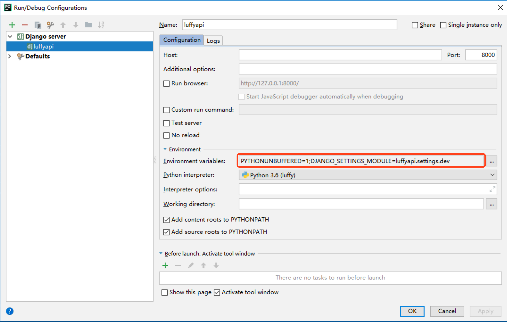

## 后台：Django项目创建

### 环境

```python
"""
为luffy项目创建一个虚拟环境
>: mkvirtualenv luffy
"""

"""
按照基础环境依赖
>: pip install django==2.0.7
>: pip install djangorestframework
>: pip install pymysql
"""
```


### 创建项目

```python
"""
前提：在目标目录新建luffy文件夹
>: cd 建立的luffy文件夹
>: django-admin startproject luffyapi

开发：用pycharm打开项目，并选择提前备好的虚拟环境
"""
```


## 重构项目目录

```python
"""
├── luffyapi
	├── logs/				# 项目运行时/开发时日志目录 - 包
    ├── manage.py			# 脚本文件
    ├── luffyapi/      		# 项目主应用，开发时的代码保存 - 包
     	├── apps/      		# 开发者的代码保存目录，以模块[子应用]为目录保存 - 包
        ├── libs/      		# 第三方类库的保存目录[第三方组件、模块] - 包
    	├── settings/  		# 配置目录 - 包
			├── dev.py   	# 项目开发时的本地配置
			└── prod.py  	# 项目上线时的运行配置
		├── urls.py    		# 总路由
		└── utils/     		# 多个模块[子应用]的公共函数类库[自己开发的组件]
    └── scripts/       		# 保存项目运营时的脚本文件 - 文件夹
"""
```


## 配置开发环境

```python
"""
1.修改 wsgi.py 与 manage.py 两个文件：
os.environ.setdefault('DJANGO_SETTINGS_MODULE', 'luffyapi.settings.dev')

2.将settings.py删除或改名，内容拷贝到settings/dev.py中

3.修改dev.py文件内容
LANGUAGE_CODE = 'zh-hans'
TIME_ZONE = 'Asia/Shanghai'
USE_TZ = False

4.修改启动配置：见插图

5.在任何一个__init__.py文件中测试默认配置文件是否是dev.py文件
from django.conf import settings
print(settings)
"""
```




## 环境变量

##### dev.py

```python
# 环境变量操作：小luffyapiBASE_DIR与apps文件夹都要添加到环境变量
import sys
sys.path.insert(0, BASE_DIR)
APPS_DIR = os.path.join(BASE_DIR, 'apps')
sys.path.insert(1, APPS_DIR)
```

##### 在写项目直接导入utils文件夹也不''错误提示''


## 配置日志->封装logger

##### dev.py

```python
# 真实项目上线后，日志文件打印级别不能过低，因为一次日志记录就是一次文件io操作
LOGGING = {
    'version': 1,
    'disable_existing_loggers': False,
    'formatters': {
        'verbose': {
            'format': '%(levelname)s %(asctime)s %(module)s %(lineno)d %(message)s'
        },
        'simple': {
            'format': '%(levelname)s %(module)s %(lineno)d %(message)s'
        },
    },
    'filters': {
        'require_debug_true': {
            '()': 'django.utils.log.RequireDebugTrue',
        },
    },
    'handlers': {
        'console': {
            # 实际开发建议使用WARNING
            'level': 'DEBUG',
            'filters': ['require_debug_true'],
            'class': 'logging.StreamHandler',
            'formatter': 'simple'
        },
        'file': {
            # 实际开发建议使用ERROR
            'level': 'INFO',
            'class': 'logging.handlers.RotatingFileHandler',
            # 日志位置,日志文件名,日志保存目录必须手动创建，注：这里的文件路径要注意BASE_DIR代表的是小luffyapi
            'filename': os.path.join(os.path.dirname(BASE_DIR), "logs", "luffy.log"),
            # 日志文件的最大值,这里我们设置300M
            'maxBytes': 300 * 1024 * 1024,
            # 日志文件的数量,设置最大日志数量为10
            'backupCount': 10,
            # 日志格式:详细格式
            'formatter': 'verbose',
            # 文件内容编码
            'encoding': 'utf-8'
        },
    },
    # 日志对象
    'loggers': {
        'django': {
            'handlers': ['console', 'file'],
            'propagate': True, # 是否让日志信息继续冒泡给其他的日志处理系统
        },
    }
}
```

##### utils/logging.py

```python
import logging
logger = logging.getLogger('django')
```


## 封装项目异常处理

##### utils/exception.py

```python
from rest_framework.views import exception_handler as drf_exception_handler
from rest_framework.views import Response
from rest_framework import status
from utils.logging import logger
def exception_handler(exc, context):
    response = drf_exception_handler(exc, context)
    # 异常模块就是记录项目的错误日志
    logger.error('%s - %s - %s' % (context['view'], context['request'].method, exc))
    if response is None:
        return Response({
            'detail': '%s' % exc
        }, status=status.HTTP_500_INTERNAL_SERVER_ERROR, exception=True)
    return response
```

##### settings.py

```python
REST_FRAMEWORK = {
    'EXCEPTION_HANDLER': 'utils.exception.exception_handler',
}
```


## 二次封装Response模块

##### utils/response.py

```python
from rest_framework.response import Response

class APIResponse(Response):
    def __init__(self, data_status=0, data_msg='ok', results=None, http_status=None, headers=None, exception=False, **kwargs):
        data = {
            'status': data_status,
            'msg': data_msg,
        }
        if results is not None:
            data['results'] = results
        data.update(kwargs)

        super().__init__(data=data, status=http_status, headers=headers, exception=exception)
```


