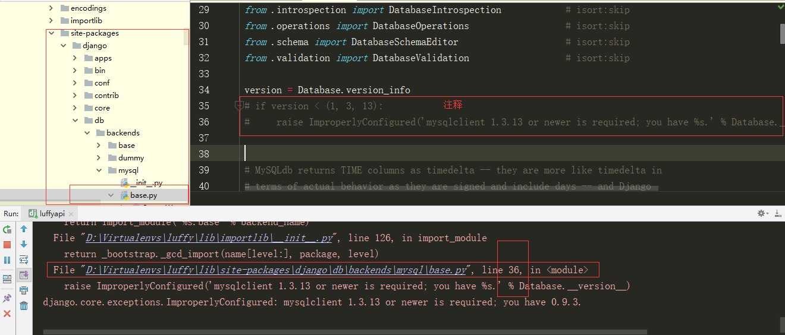
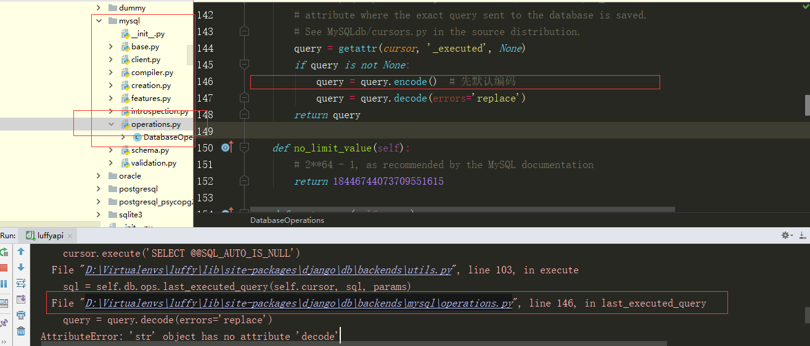

## 数据库配置

### 创建数据库

```python
"""
1.管理员连接数据库
>: mysql -uroot -proot

2.创建数据库
>: create database luffy default charset=utf8;

3.查看用户
>: select user,host,password from mysql.user;
"""
```


### 为指定数据库配置指定账户

```python
"""
设置权限账号密码
# 授权账号命令：grant 权限(create, update) on 库.表 to '账号'@'host' identified by '密码'

1.配置任意ip都可以连入数据库的账户
>: grant all privileges on luffy.* to 'luffy'@'%' identified by 'Luffy123?';

2.由于数据库版本的问题，可能本地还连接不上，就给本地用户单独配置
>: grant all privileges on luffy.* to 'luffy'@'localhost' identified by 'Luffy123?';

3.刷新一下权限
>: flush privileges;

只能操作luffy数据库的账户
账号：luffy
密码：Luffy123?
"""
```


### Django 2.x 一些版本pymysql兼容问题

##### Django不采用2.0.7版本很可能出现以下问题，需要修改源代码



