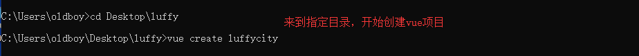
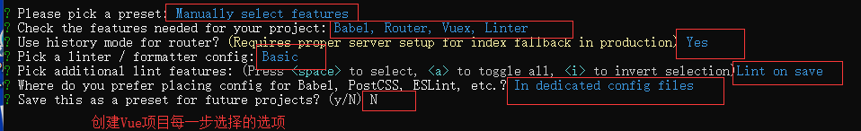

# 前台

### vue环境

```
1.傻瓜式安装node: 
官网下载：https://nodejs.org/zh-cn/

2.安装cnpm: 
>: npm install -g cnpm --registry=https://registry.npm.taobao.org

3.安装vue最新脚手架: 
>: cnpm install -g @vue/cli

注：如果2、3步报错，清除缓存后重新走2、3步
>: npm cache clean --force
```


### 创建项目

```python
"""
前提：在目标目录新建luffy文件夹
>: cd 建立的luffy文件夹
>: vue create luffycity
"""
```






### 重构项目目录

```python
"""
├── luffycity
	├── public/          			# 项目共有资源
		├── favicon.ico				# 站点图标
		└── index.html				# 主页
    ├── src/      					# 项目主应用，开发时的代码保存
    	├── assets/      			# 前台静态资源总目录
    		├── css/				# 自定义css样式
    			└── global.css		# 自定义全局样式
    		├── js/					# 自定义js样式
				└── settings.js		# 自定义配置文件
			└── img/				# 前台图片资源
		├── components/    			# 小组件目录
		├── views/  				# 页面组件目录
		├── App.vue	    			# 根路由
		├── main.js	    			# 入口脚本文件
		├── router    		
			└── index.js			# 路由脚本文件
		store	    		
			└── index.js			# 仓库脚本文件
    ├── vue.config.js	    		# 项目配置文件
    └── *.*							# 其他配置文件
"""
```


### 文件修订：目录中非配置文件的多余文件可以移除

##### App.vue

```vue
<template>
    <div id="app">
        <router-view/>
    </div>
</template>
```

##### router/index.js

```js
import Vue from 'vue'
import VueRouter from 'vue-router'
import Home from '../views/Home.vue'

Vue.use(VueRouter);

const routes = [
    {
        path: '/',
        name: 'home',
        component: Home
    },
];

const router = new VueRouter({
    mode: 'history',
    base: process.env.BASE_URL,
    routes
});

export default router
```

##### Home.vue

```vue
<template>
    <div class="home">
    </div>
</template>

<script>
    export default {
        name: 'home',
        components: {
        },
    }
</script>
```


## 全局配置：全局样式、配置文件

##### global.css

```css
/* 声明全局样式和项目的初始化样式 */
body, h1, h2, h3, h4, p, table, tr, td, ul, li, a, form, input, select, option, textarea {
    margin: 0;
    padding: 0;
    font-size: 15px;
}

a {
    text-decoration: none;
    color: #333;
}

ul {
    list-style: none;
}

table {
    border-collapse: collapse; /* 合并边框 */
}
```

##### settings.js

```js
export default {
    base_url: 'http://127.0.0.1:8000'
}
```

##### main.js

```js
// 配置全局样式
import '@/assets/css/global.css'

// 配置全局自定义设置
import settings from '@/assets/js/settings'
Vue.prototype.$settings = settings;
// 在所有需要与后台交互的组件中：this.$settings.base_url + '再拼接具体后台路由'
```


